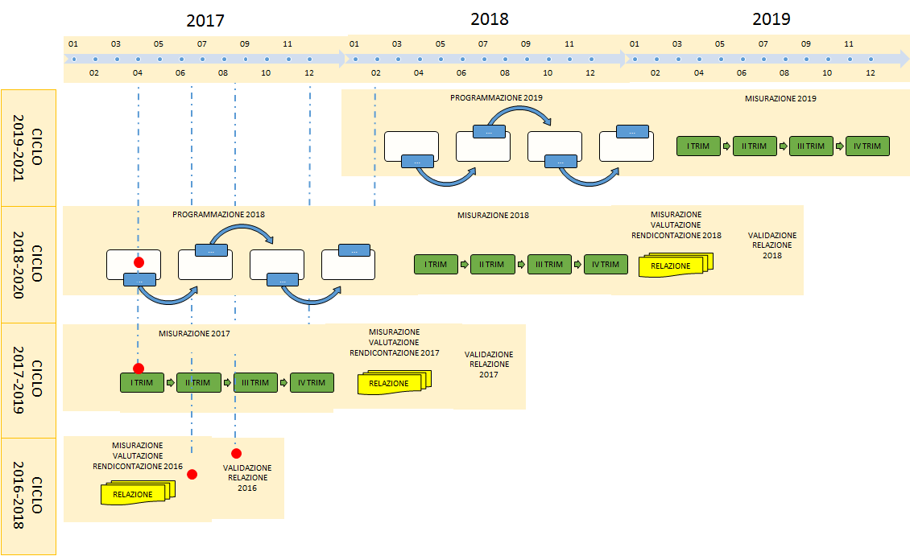
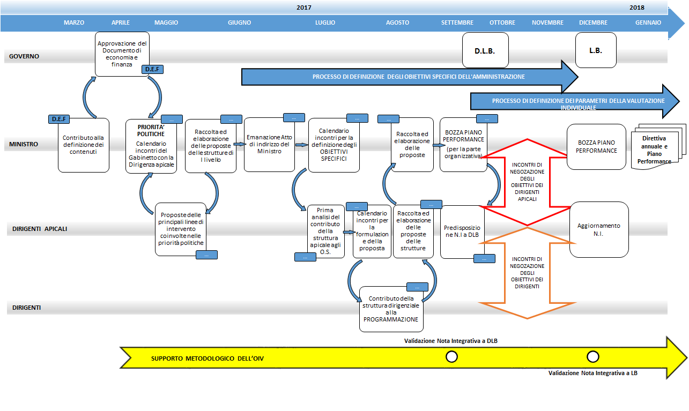
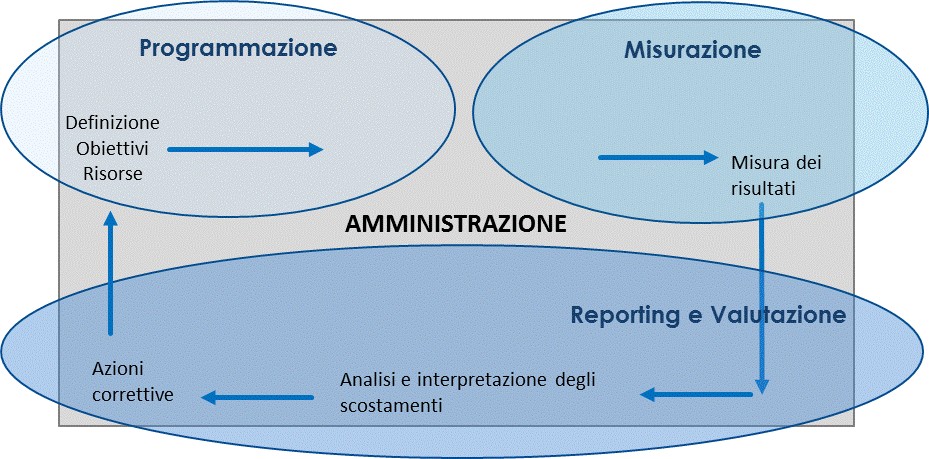
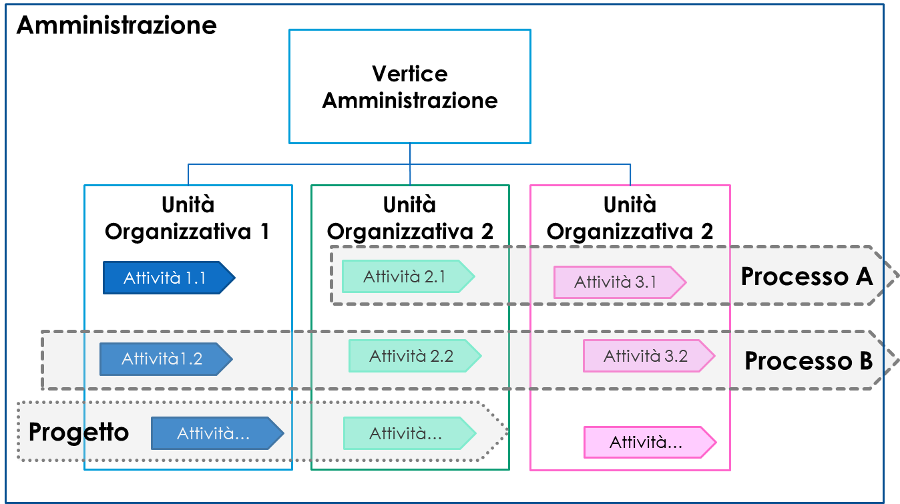
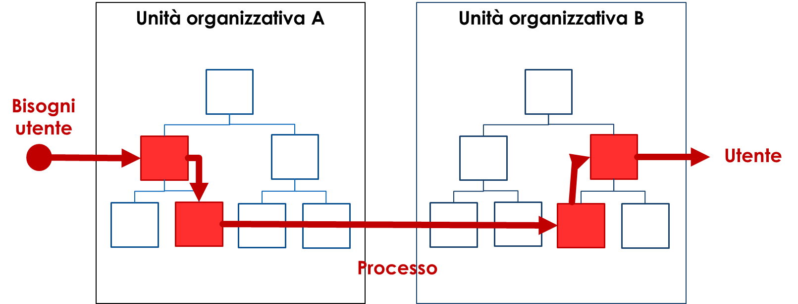
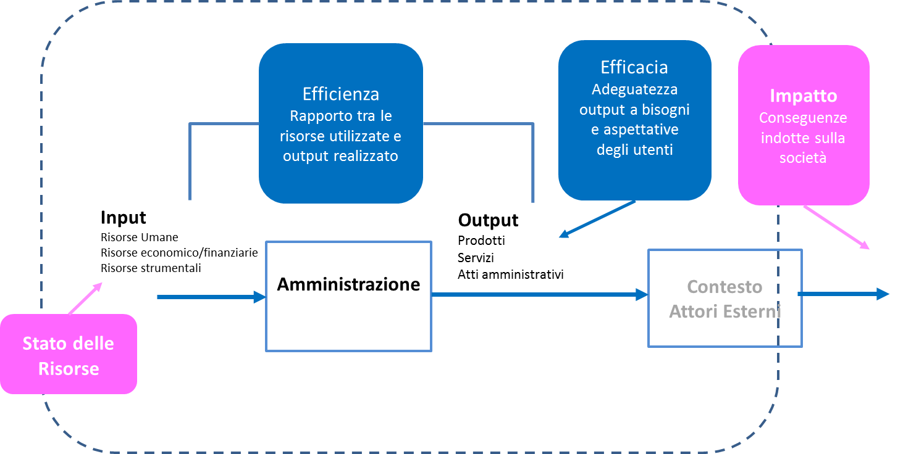
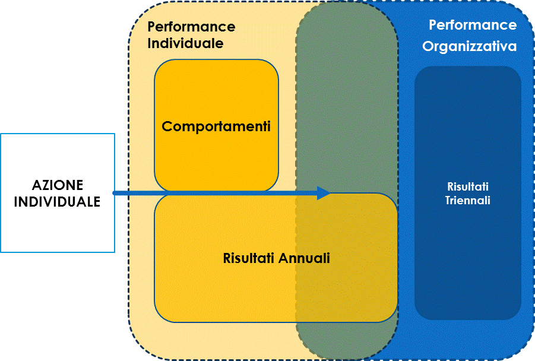

Presidenza del Consiglio dei Ministri

Dipartimento della Funzione Pubblica

Ufficio per la valutazione della *performance*

Linee guida per il sistema di misurazione e valutazione della *performance*
===========================================================================

**Ministeri**

**N. 2**

**Dicembre 2017**

*Queste linee guida sono redatte ai sensi del d.lgs. 150/2009 e
dell'articolo 3, comma 1, del dPR n. 105 del 2016 che attribuiscono al
Dipartimento della Funzione Pubblica (DFP) le funzioni di indirizzo,
coordinamento e monitoraggio in materia di ciclo della performance,
avvalendosi del supporto tecnico e metodologico della Commissione
Tecnica per la Performance (CTP) di cui all'articolo 4 del citato dPR.*

*In questa sede, in particolare, si intendono delineare le modifiche al
precedente quadro degli indirizzi così come definito dalle delibere
CIVIT/ANAC, relativamente al Sistema di Misurazione e Valutazione della
Performance di cui all'art. 7 del d.lgs. 150/2009.*

*Le presenti linee guida sostituiscono, per i ministeri, le seguenti
Delibere CIVIT/ANAC:*

1. *Delibera n. 89/2010;*

2. *Delibera n. 104/2010;*

3. *Delibera n. 114/2010;*

4. *Delibera n. 1/2012, paragrafi 3 e 4*.

Introduzione alle linee guida
-----------------------------

Queste linee guida forniscono indicazioni in ordine alla progettazione e
alla revisione annuale del Sistema di Misurazione e Valutazione della
*Performance* (nel seguito SMVP) che ogni amministrazione adotta ai
sensi dell'art. 7 del d.lgs. 150/2009.

Nella consapevolezza che le amministrazioni hanno già maturato
esperienza in materia, avendo già adottato il proprio SMVP, l'approccio
metodologico sotteso a queste linee guida può essere così sintetizzato:

-  affronta alcuni aspetti emersi come particolarmente critici
   dall'analisi dei SMVP attualmente in uso, nonché dall'esperienza
   maturata all'interno dei laboratori sulla *performance*\  [1]_
   attivati nel corso del 2017, quali la differenza tra misurazione e
   valutazione ed il collegamento tra *performance* organizzativa e
   *performance* individuale;

-  consente alle amministrazioni, nell'ambito della propria autonomia,
   di declinare i SMVP nella maniera più funzionale alle proprie
   esigenze organizzative;

-  non fornisce indicazioni dettagliate e vincolanti sui singoli
   contenuti dei SMVP; l'esperienza ha insegnato che un approccio
   eccessivamente prescrittivo rischia di limitare la capacità di
   personalizzazione di strumenti, quali quelli legati alla misurazione
   e valutazione della *performance*, che, per essere efficaci,
   richiedono una forte coerenza con il contesto organizzativo in cui
   sono chiamati ad operare.

Coerentemente alla scelta di rilascio modulare operata con le linee
guida n. 1/2017, anche queste linee guida si rivolgono ai ministeri, in
ragione delle specifiche caratteristiche che il ciclo della
*performance* assume in tali organizzazioni.

Resta fermo che gli indirizzi metodologici e le indicazioni di carattere
generale sono applicabili anche alle altre amministrazioni dello Stato,
che potranno adeguarvisi in sede di revisione dei propri SMVP.

Il seguito del documento si articola come segue: il capitolo 2 si
riferisce al ciclo della *performance*, il capitolo 3 alle attività di
misurazione e valutazione, il capitolo 4 alla misurazione e valutazione
della *performance* organizzativa e, infine, il 5 si riferisce alla
misurazione e valutazione della *performance* individuale.

Il ciclo della *performance* e il Sistema di Misurazione e Valutazione
----------------------------------------------------------------------

Il SMVP è un insieme di tecniche, risorse e processi che assicurano il
corretto svolgimento delle funzioni di programmazione, misurazione,
valutazione e rendicontazione della *performance*, ossia del ciclo della
*performance*.

Sulla base del d.lgs. 150/2009, modificato dal d.lgs. 74/2017, le
amministrazioni pubblicano e aggiornano annualmente un documento che ne
descrive il funzionamento; in tale documento, ciascuna amministrazione,
tenuto conto del quadro normativo di riferimento, nonché degli indirizzi
forniti dal Dipartimento della Funzione Pubblica (DFP), riporta anche i
ruoli e le responsabilità di ciascuno dei soggetti coinvolti nelle
diverse fasi di programmazione, misurazione, valutazione e
rendicontazione.

Nella figura 1 è rappresentata la sequenza temporale di tutte le fasi
del ciclo della *performance* con orizzonte triennale. Sull'asse
orizzontale è riportato il calendario relativo al triennio di
riferimento (N-1 – N+1). Il posizionamento temporale delle fasi è
indicativo e tiene conto della loro complessità, nonché del contesto
normativo.

L'asse verticale riporta invece la sequenza dei cicli a cui si
riferiscono le singole attività realizzate. Le linee verticali
tratteggiate consentono di visualizzare come le amministrazioni sono
chiamate a svolgere in parallelo attività relative a cicli della
*performance* di anni diversi. Ad esempio, ad aprile 2017 è iniziata la
fase di pianificazione riferita al ciclo 2018-2020; contestualmente sono
state messe in atto le attività di monitoraggio/misurazione relative
all'anno in corso (ciclo 2017-2019) e sono stati elaborati gli esiti
delle misurazioni riferite al ciclo precedente (2016-2018) per la
valutazione e la predisposizione della Relazione sulla *performance*
relativa al 2016.

I tre cicli sono connessi l'uno all'altro: i risultati, anche se
preliminari, riferiti ad un anno influenzano la pianificazione relativa
a quelli successivi.

La figura 2 entra invece nel dettaglio del ciclo annuale di
pianificazione e programmazione, che si avvia dopo la presentazione alle
Camere del Documento di Economia e Finanza (DEF) e termina con la
pubblicazione del Piano della *performance*, entro il 31 gennaio
dell'anno successivo. La figura mostra come, nell'arco temporale che va
all'incirca da aprile dell'anno di riferimento (N) al mese di gennaio
dell'anno successivo (N+1), i diversi soggetti interagiscono, a quale
livello (organo di indirizzo politico, dirigenti apicali, dirigenti di
II fascia/titolari di posizioni organizzative) e per la definizione di
quali contenuti del Piano (obiettivi specifici, obiettivi annuali,
obiettivi individuali, etc.).

Anche in questo caso la collocazione temporale delle attività è
indicativa e finalizzata a fornire un riferimento per le diverse
attività del ciclo della *performance*. Ogni amministrazione può
“personalizzare” il flusso delle attività nel rispetto delle scadenze
definite dal d.lgs. 150/2009.

Inoltre, nella figura 2 sono evidenziati i diversi attori coinvolti.

*Figura 1 – Sequenza temporale delle fasi del ciclo della performance*

|image2|

*Figura 2 – Dettaglio della fase di pianificazione e programmazione del
ciclo della performance*

|image3|

La schematizzazione riportata nella figura 2 consente anche di
richiamare l'attenzione sul disegno delle responsabilità, delle funzioni
e dei ruoli dei diversi soggetti nell'ambito del SMVP: tale disegno è
una delle componenti essenziali per l'efficace funzionamento del SMVP ed
il suo effettivo utilizzo nei processi decisionali e gestionali
dell'amministrazione.

Le soluzioni organizzative che possono essere adottate da ciascuna
amministrazione sono molteplici e dipendono dalla storia, dal contesto
interno dell'amministrazione e dalle scelte ritenute più adeguate.

Il ciclo della *performance* vede in prima linea i decisori politici e
amministrativi. Nello specifico:

-  l'organo di indirizzo politico-amministrativo, al quale compete
   l'esercizio della funzione di indirizzo e la definizione degli
   obiettivi da perseguire e dei programmi da attuare;

-  i dirigenti apicali, titolari di Centri di Responsabilità
   Amministrativa (CRA), cui compete la responsabilità univoca dei
   programmi di bilancio assegnati ai CRA medesimi e la responsabilità
   dell'attività amministrativa, della gestione e dei relativi
   risultati;

-  i dirigenti e i titolari di posizioni organizzative, che partecipano
   al processo di programmazione, contribuendo a definire risorse e
   obiettivi nella fase *top down* e successivamente in quella *bottom
   up*, al processo di monitoraggio e infine alla valutazione, sia come
   soggetti valutatori che come soggetti valutati.

Gli OIV forniscono, lungo tutto il ciclo, un supporto metodologico volto
ad assicurare efficacia, solidità e affidabilità al SMVP. Più nel
dettaglio, anche alla luce della disciplina introdotta con il d.lgs.
74/2017, le funzioni attribuite agli OIV sono:

-  *presidio tecnico metodologico* del SMVP che si esprime
   prevalentemente attraverso la formulazione del parere vincolante sul
   SMVP (vedi Box 1), la validazione della Relazione sulla *performance*
   e la Relazione annuale sul funzionamento del Sistema;

-  *valutazione della performance organizzativa*, effettuata nel
   rispetto degli indirizzi espressi in queste linee guida;

-  *monitoraggio della performance organizzativa*, ovvero verifica
   dell'andamento della *performance* dell'amministrazione rispetto agli
   obiettivi programmati e segnalazione all'organo di indirizzo politico
   dell'esigenza di interventi correttivi;

-  *proposta di valutazione* annuale dei dirigenti di vertice e
   trasmissione all'organo di indirizzo politico-amministrativo.

In riferimento al ruolo dell'OIV, è opportuno che il disegno del SMVP
tenga conto di due requisiti essenziali per la sua efficacia:

-  condivisione, fra OIV e amministrazione, delle modalità ottimali per
   consentire all'OIV il pieno e autonomo accesso alle informazioni
   rilevanti e alla conoscenza dei fenomeni gestionali e amministrativi;

-  dotazione di un'adeguata struttura tecnica, in possesso delle
   conoscenze e delle competenze professionali necessarie per il
   supporto delle funzioni proprie dell'OIV (quali, ad esempio,
   conoscenza della struttura organizzativa dell'amministrazione,
   capacità di analisi dei processi, conoscenza dei sistemi di
   pianificazione e controllo, utilizzo dei sistemi informativi, etc.) e
   individuazione, all'interno dell'amministrazione, della collocazione
   più adeguata per tale struttura, al fine di garantire l'indipendenza
   funzionale e operativa dell'OIV.

L'interazione fra OIV e amministrazione deve portare benefici reciproci
in termini di scambio di informazioni, costruzione di una visione
sistemica condivisa, segnalazione tempestiva di scostamenti e
definizione appropriata di interventi correttivi, sia nei processi di
amministrazione attiva, sia nei processi di supporto e controllo di
gestione.

È bene comunque sottolineare che non devono confondersi le
responsabilità proprie dell'OIV con quelle proprie dei dirigenti. I
dirigenti sono responsabili in via esclusiva dell'attività
amministrativa, della gestione e dei relativi risultati.

+-----------------------------------------------------------------------+
| **Box 1 – Il parere vincolante sul SMVP da parte dell'OIV**           |
|                                                                       |
| L'OIV esprime il proprio parere sul SMVP valutando la coerenza delle  |
| scelte operate dall'amministrazione con il quadro normativo vigente e |
| lo specifico contesto interno (organizzativo) ed esterno (*policy* e  |
| *stakeholders*) dell'amministrazione di appartenenza.                 |
|                                                                       |
| A tal fine, in relazione alle modalità di misurazione e valutazione   |
| della *performance* organizzativa, l'OIV considera in particolare la  |
| corretta declinazione della dimensione temporale (orizzonte           |
| strategico pluriennale collegato alla dimensione di *outcome* e       |
| orizzonte annuale collegato alle unità di analisi della *performance* |
| organizzativa illustrate al par. 4.1), le fonti e tipologie di        |
| indicatori (vedi par. 4.2), le modalità di raccordo con il ciclo del  |
| bilancio, i sistemi di rilevazione del grado di soddisfazione di      |
| cittadini e utenti adottati dall'amministrazione, la dettagliata      |
| descrizione di tutte le fasi del ciclo e la chiarezza dei ruoli       |
| attribuiti ai diversi soggetti nelle varie fasi illustrate nella      |
| precedente figura 2.                                                  |
|                                                                       |
| Nell'esprimere il proprio parere sul SMVP, l'OIV tiene conto del      |
| contesto organizzativo e delle risorse dell'amministrazione.          |
|                                                                       |
| Se ad esempio un'amministrazione non utilizza un sistema di           |
| contabilità analitica, gli indicatori di costo ed efficienza          |
| economica collegati ai processi saranno probabilmente poco            |
| significativi; in tal caso, è opportuno che l'OIV suggerisca          |
| all'amministrazione un percorso graduale e sostenibile di adeguamento |
| del SMVP entro scadenze prefissate. I progressi realizzati lungo tale |
| percorso dovranno essere presi in considerazione in sede di Relazione |
| annuale sullo stato del SMVP.                                         |
|                                                                       |
| In relazione alle modalità di misurazione e valutazione della         |
| *performance* individuale, l'OIV formula un parere con particolare    |
| riferimento ai parametri che compongono la *performance* individuale  |
| e alla correttezza metodologica delle misure adottate (vedi par.      |
| 5.1), al processo della valutazione individuale e alla chiarezza      |
| delle modalità con cui viene formulata la valutazione finale (vedi    |
| par 5.2) e alle procedure di conciliazione a garanzia dei valutati.   |
|                                                                       |
| Anche riguardo alla misurazione e valutazione della *performance*     |
| individuale, nella formulazione del parere, l'OIV deve tener conto    |
| dello specifico contesto per assicurare la sostenibilità degli        |
| eventuali cambiamenti suggeriti.                                      |
|                                                                       |
| Tali suggerimenti, in coerenza con la previsione di aggiornamento     |
| annuale del SMVP da parte dell'amministrazione, sono contenuti nella  |
| Relazione annuale sul funzionamento del SMVP, che è il documento nel  |
| quale l'OIV rende conto del funzionamento complessivo del SMVP e      |
| formula proposte e raccomandazioni ai vertici dell'amministrazione,   |
| al fine di aiutare l'amministrazione nell'introduzione di modifiche   |
| migliorative.                                                         |
+-----------------------------------------------------------------------+

Misurazione e valutazione della *performance*
---------------------------------------------

Per le finalità di queste linee guida è utile definire e distinguere le
*attività di misurazione* da quelle *di valutazione*.

Per *misurazione* si intende l'attività di quantificazione del livello
di raggiungimento dei risultati e degli impatti da questi prodotti su
utenti e *stakeholder*, attraverso il ricorso a indicatori.

Per *valutazione* si intende l'attività di analisi e interpretazione dei
valori misurati, che tiene conto dei fattori di contesto che possono
avere determinato l'allineamento o lo scostamento rispetto ad un valore
di riferimento.

*Misurazione e valutazione della performance sono attività distinte ma
complementari*, in quanto fasi del più ampio **Ciclo della
Performance**. La figura seguente illustra il ciclo complessivo.

*Figura 3 – Il ciclo della Performance nelle amministrazioni centrali
dello Stato*

|image4|

Nella prima fase del ciclo (*programmazione*), l'amministrazione
definisce gli obiettivi che si prefigge di raggiungere nel medio-lungo e
nel breve periodo. La fase di programmazione serve ad orientare le
*performance* individuali in funzione della *performance* organizzativa
attesa e quest'ultima in funzione della creazione di valore pubblico,
ovvero del miglioramento del livello di benessere dei destinatari delle
politiche e dei servizi.

L'*output* della fase di programmazione non è unico, ma include
diversi documenti di programmazione (anche in virtù delle diverse
finalità degli atti di programmazione previsti dalle disposizioni
normative vigenti), complementari l'uno all'altro in quanto tutti parte
di un unico e più ampio processo di pianificazione e programmazione
(vedi il box 2 riportato di seguito).

+-----------------------------------------------------------------------+
| **Box 2 – I documenti di programmazione nei ministeri e la loro       |
| collocazione nel ciclo della performance**                            |
|                                                                       |
| Ai fini di una efficace gestione del processo di pianificazione e     |
| programmazione e di una sua corretta formalizzazione, sono fornite    |
| indicazioni in merito alle funzioni proprie dei tre documenti         |
| principali che, per i ministeri, sono:                                |
|                                                                       |
| 1) Piano della *performance*;                                         |
|                                                                       |
| 2) Nota integrativa a Legge di Bilancio;                              |
|                                                                       |
| 3) Direttiva generale sull'azione amministrativa e la gestione.       |
|                                                                       |
| Essi sono diverse rappresentazioni dei contenuti propri di un unico   |
| processo che prende avvio dalle priorità politiche del Ministro e dai |
| documenti che descrivono le politiche generali del Governo. Sulla     |
| base di tali priorità e politiche sono individuati, in ciascuno dei   |
| documenti sopra elencati, gli obiettivi da perseguire.                |
|                                                                       |
| In particolare, nel Piano della *performance* sono definiti: gli      |
| obiettivi specifici triennali, che descrivono la strategia e i        |
| traguardi di medio-lungo periodo che l'amministrazione intende        |
| raggiungere e che ne orientano il funzionamento complessivo; gli      |
| obiettivi annuali, che rappresentano la declinazione degli obiettivi  |
| specifici triennali, così come indicato nelle LG 1/2017.              |
|                                                                       |
| Nella Nota integrativa sono riportati gli obiettivi strategici e      |
| strutturali assegnati ai CRA unitamente ai rispettivi stanziamenti di |
| bilancio. La relazione fra Piano e Nota integrativa è già stata       |
| descritta nelle linee guida n. 1/2017.                                |
|                                                                       |
| Nella Direttiva generale sull'azione amministrativa e la gestione     |
| sono definiti gli obiettivi annuali di tutte le unità dirigenziali di |
| primo livello (strutture di livello dirigenziale generale), compresi  |
| gli obiettivi che non sono direttamente riconducibili al livello      |
| triennale della programmazione.                                       |
|                                                                       |
| La Direttiva costituisce un elemento del Sistema di misurazione e     |
| valutazione della *performance*, in coerenza con l'art. 9 del d.lgs.  |
| 150/09 che prevede che “\ *La misurazione e valutazione della         |
| performance* individuale *dei dirigenti titolari degli incarichi di   |
| cui all'art. 19, commi 3 e 4, del decreto legislativo 30 marzo 2001,  |
| n. 165, è collegata altresì al raggiungimento degli obiettivi         |
| individuati nella direttiva generale per l'azione amministrativa e la |
| gestione […], nonché di quelli specifici definiti nel contratto*      |
| individuale\ *”.* Infine, per le strutture di livello dirigenziale    |
| non generale, i cui obiettivi, che per loro natura non sono inserti   |
| nella Direttiva, non fossero rappresentati neanche nel Piano in virtù |
| della selettività di quest'ultimo, l'amministrazione prevede nel SMVP |
| adeguate modalità per la loro rappresentazione e formalizzazione      |
| (schede assegnazione obiettivi, altro).                               |
|                                                                       |
| La Direttiva, nonché gli altri documenti all'interno dei quali sono   |
| formalizzati gli obiettivi assegnati al personale dirigente,          |
| costituiscono tutti elementi del ciclo della *performance*, con la    |
| conseguenza che:                                                      |
|                                                                       |
| -  il monitoraggio previsto dall'art. 6 del d.lgs. 150/2009 ha per    |
|    oggetto tutti gli obiettivi programmati durante il periodo di      |
|    riferimento, sia quelli inseriti nel Piano che quelli individuati  |
|    nella Direttiva, in relazione ai quali gli OIV devono segnalare la |
|    necessità o l'opportunità di interventi correttivi in corso di     |
|    esercizio all'organo di indirizzo politico-amministrativo;         |
|                                                                       |
| -  gli OIV in sede di redazione della Relazione annuale sul           |
|    funzionamento complessivo del sistema analizzano le modalità di    |
|    svolgimento del processo di misurazione e valutazione di tutti gli |
|    obiettivi programmati ovunque formalizzati (Piano, Direttiva,      |
|    schede individuali) segnalando eventuali criticità riscontrate e   |
|    formulando proposte e raccomandazioni ai vertici amministrativi.   |
+-----------------------------------------------------------------------+

La fase di *misurazione* serve a quantificare: i risultati raggiunti
dall'amministrazione nel suo complesso, i contributi delle articolazioni
organizzative e dei gruppi (*performance* organizzativa); i contributi
individuali (*performance* individuali).

La misurazione può essere realizzata in momenti differenti in relazione
alle esigenze dei diversi decisori. Tipicamente, infatti, i sistemi
prevedono delle misurazioni intermedie (monitoraggio) ed una misurazione
finale alla conclusione del periodo (anno) di riferimento. La frequenza
del monitoraggio può variare a seconda delle caratteristiche dei
fenomeni oggetto di osservazione. In tutti i casi le attività di
monitoraggio devono essere documentate mediante un efficace sistema di
reportistica.

Nell'ultima fase, sulla base del livello misurato di raggiungimento
degli obiettivi rispetto ai *target* prefissati, si effettua la
*valutazione,* ovvero si formula un “giudizio” complessivo sulla
*performance*, cercando di comprendere i fattori (interni ed esterni)
che possono aver influito positivamente o negativamente sul grado di
raggiungimento degli obiettivi medesimi, anche al fine di apprendere per
migliorare nell'anno successivo.

In base al d.lgs. 150/2009 la fase di valutazione deve avere come
*output* la **Relazione annuale sulla Performance** che, evidenzia, a
consuntivo, i risultati organizzativi e individuali raggiunti rispetto
agli obiettivi programmati e formalizzati nel Piano. Nella Relazione,
l'amministrazione inoltre evidenzia le modalità secondo cui si è svolto,
nell'anno di riferimento, l'intero processo di misurazione e
valutazione.

È infine importante precisare che la misurazione e valutazione della
*performance* si riferiscono ad unità di analisi differenti ma tra loro
correlate:

1. *amministrazione nel suo complesso*, ad esempio il Ministero delle
   infrastrutture e trasporti (MIT) in modo unitario includendo sia le
   strutture centrali che periferiche;

2. *singole articolazioni dell'amministrazione,* lungo tutto la linea
   organizzativa, centrali o periferiche; con riferimento al MIT ad
   esempio: il Dipartimento per le infrastrutture, i sistemi informativi
   e statistici (I livello), la Direzione generale per la regolazione e
   i contratti pubblici (II livello), il Provveditorato alle opere
   pubbliche (articolazione territoriale), la Div. 1 - Affari generali
   della Direzione generale per la regolazione e i contratti pubblici
   (III livello);

3. *processi e progetti,* su cui si tornerà nel paragrafo 4.1;

4. *individui*.

Le unità di analisi 1, 2, 3 rientrano nel perimetro della *performance*
organizzativa; mentre quando il *focus* si sposta sull'individuo si
entra nel campo della *performance* individuale.

È evidente che *performance* organizzativa e *performance* individuale
sono strettamente correlate in tutte le fasi del ciclo: solo l'azione
programmata e coordinata degli individui consente infatti il
raggiungimento di risultati organizzativi.

La misurazione e valutazione della *performance* organizzativa
--------------------------------------------------------------

In questo paragrafo si entra nel dettaglio del sistema di misurazione e
valutazione della *performance* organizzativa, soffermandoci in
particolare su quattro elementi: le unità di analisi della misurazione,
gli indicatori, il passaggio dalla misurazione alla valutazione, la
partecipazione di cittadini ed utenti.

Le unità di analisi della misurazione
~~~~~~~~~~~~~~~~~~~~~~~~~~~~~~~~~~~~~

La misurazione della *performance* organizzativa può essere riferita a
tre diverse unità di analisi: (1) amministrazione nel suo complesso; (2)
singole unità organizzative dell'amministrazione; (3) processi e
progetti.

Le tre unità di analisi non sono necessariamente alternative nei SMVP,
in quanto consentono di cogliere insiemi diversi di responsabilità, tra
loro nidificati. Nel proprio SMVP ciascuna amministrazione deve indicare
quali saranno le unità di analisi alle quali verrà fatto riferimento in
sede di misurazione e valutazione della *performance* organizzativa. Si
ricorda, tra l'altro, che ai sensi del nuovo articolo 19 del d.lgs.
150/2009 alla retribuzione della performance organizzativa deve essere
destinata una quota delle risorse del fondo relativo al trattamento
economico accessorio.

Un utile elemento di riferimento per tutte le tre unità di analisi è
l'attività.

Per le finalità di queste linee guida col termine **attività** si
intende un **insieme omogeneo di compiti, realizzato all'interno di una
stessa unità organizzativa,** caratterizzato da:

-  un *output* chiaramente identificabile, che per le amministrazioni
   può essere un prodotto o servizio (ad esempio erogazione di un
   beneficio, rilascio di un'autorizzazione o produzione di un atto
   normativo o amministrativo);

-  *input,* ossia dalle risorse utilizzate per realizzare *l'output* che
   possono includere risorse umane, finanziarie o strumentali.

L'attività può essere vista come una unità elementare comune a tutte e
tre le unità di analisi sopra declinate. La figura 4 illustra questo
legame.

*Figura 4 – Il legame tra le unità di analisi*

|image5|

L'attività è un utile elemento per la misurazione e valutazione della
*performance* per diverse ragioni:

-  l'attività è un elemento più stabile rispetto alla struttura
   organizzativa. Se la misurazione viene legata alle attività, nel
   momento di un cambiamento organizzativo è sufficiente trasferire la
   responsabilità della *performance* associata ad una data attività da
   un'unità organizzativa all'altra;

-  le attività agevolano il confronto fra le amministrazioni. Nel caso
   dei ministeri, pur avendo ciascuno un insieme di attività specifiche
   legate alla propria missione, tutti hanno un insieme di attività
   comuni legate al supporto interno (contabilità, personale,
   approvvigionamenti, etc.). Misurare le attività sulla base di un
   comune glossario, consentirebbe di individuare buone pratiche nella
   gestione, favorendo il miglioramento della *performance*;

-  lo schema per attività consente di avere un quadro di che cosa fa
   l'amministrazione.

Si precisa che per le finalità del SMVP, la mappatura delle attività
deve essere selettiva in quanto finalizzata ad individuare le
*performance* rilevanti per l'amministrazione nel suo complesso, di
singole unità organizzative o di processi e progetti.

Particolare attenzione viene qui di seguito dedicata ai processi e ai
progetti. Essi infatti solo raramente vengono tenuti in considerazione
come unità di analisi per la misurazione della *performance*
organizzativa, mentre, invece, il loro corretto utilizzo potrebbe
aiutare le amministrazioni ad una più efficace rappresentazione dei
risultati.

Per le finalità di queste linee guida il **processo** è definito come
una **sequenza organizzata di attività finalizzate alla creazione di un
output** richiesto o necessario ad un **utente (interno o esterno)** che
può attraversare più unità organizzative. Proprio la finalizzazione
verso un utente rappresenta l'elemento chiave per una più efficace
rappresentazione della *performance*.

La figura 5 illustra il concetto di processo (parte rossa dello schema),
in un caso tipico in cui il processo attraversa più unità organizzative.
Nei casi più complessi il processo può attraversare più amministrazioni.

*Figura 5 – Illustrazione di un processo trasversale alle unità
organizzative*

|image6|

Il *focus* sui processi consente di:

-  misurare l'efficacia del servizio finale all'utente, sia erogata (ad
   esempio, i tempi di erogazione di un servizio) che percepita
   (soddisfazione rispetto alla cortesia del personale), andando a
   definire sin dalla fase di programmazione gli elementi rilevanti del
   servizio/prodotto;

-  misurare l'efficienza del processo nel suo complesso e delle singole
   attività che lo compongono, mettendo eventualmente in relazione
   l'efficienza con l'efficacia;

-  cogliere le *performance* trasversali alle unità organizzative. Si
   pensi, ad esempio, al processo di erogazione di incentivi. Questo
   processo è spesso trasversale a più unità organizzative, ognuna
   coinvolta in attività diverse, come la progettazione dello schema
   normativo, la regolamentazione delle modalità di accesso, la gestione
   finanziaria dell'erogazione o le attività di comunicazione
   all'esterno. La finalità è, tuttavia, comune, e consiste
   nell'erogazione efficace ed efficiente degli incentivi. L'analisi per
   processi consente di individuare indicatori di *performance*
   trasversali legati all'utente finale e di individuare, attraverso le
   attività, i contributi più specifici delle singole unità
   organizzative;

-  agevolare la corretta individuazione degli *output* prodotti
   dall'amministrazione, con particolare riferimento ai servizi erogati
   e alla conseguente identificazione degli utenti (interni o esterni) a
   cui questi ultimi sono rivolti, rendendo più immediato il
   collegamento tra misurazione e valutazione della *performance*
   organizzativa e gli esiti delle indagini sul livello di soddisfazione
   di cittadini e utenti rispetto ai servizi erogati;

-  favorire una più corretta pianificazione delle “risorse” necessarie
   per realizzare gli *output*. Con particolare riferimento alle risorse
   umane questo approccio risulta anche coerente con le recenti
   modifiche normative in materia di pianificazione dei fabbisogni di
   profili professionali che non devono essere più legati alla dotazione
   organica;

-  incentivare la collaborazione tra unità organizzative.

Infine è utile riprendere il concetto di **progetto** nel contesto di
queste linee guida. Esso è un **insieme di attività finalizzato a
realizzare un output ben preciso in un determinato intervallo di
tempo**, differenziandosi in questo senso da un processo destinato,
invece, a ripetersi nel tempo.

La misurazione dei progetti richiede uno sforzo di definizione delle
attività specifiche legate al progetto, in genere aggiuntive rispetto
alle attività ricorrenti. Si pensi, ad esempio, allo sviluppo di un
sistema di *Open Data* per un Ministero: questo progetto richiede
attività *ad hoc* di progettazione del sistema, la scelta delle modalità
di implementazione, la definizione delle modalità di gestione. Queste
attività sono aggiuntive rispetto a quelle ricorrenti, coinvolgono più
unità organizzative ma è fondamentale che vengano pianificate,
condivise, monitorate e poi valutate.

Il progetto richiede la definizione delle attività col fine ultimo di
individuare:

-  le risorse necessarie;

-  i tempi attesi di completamento;

-  *l'output* e l'efficacia attesi per le diverse attività e
   complessivamente per il progetto.

Rispetto a quanto accade per i processi, per i progetti è importante la
tempificazione delle attività, ossia la definizione dei tempi attesi di
inizio e fine: il rispetto dei tempi con i costi ipotizzati è infatti
uno degli indicatori centrali della gestione per progetti.

Gli indicatori
~~~~~~~~~~~~~~

Gli indicatori rappresentano un elemento cardine del sistema di
misurazione.

Partendo dall'architettura del SMVP, ossia dalle unità di analisi che si
decide di misurare, occorre innanzitutto decidere quali e quanti
indicatori associare a ciascun obiettivo. In merito a quali indicatori
utilizzare, si sottolinea come nelle linee guida n. 1/2017 si sia già
auspicato l'utilizzo, in corrispondenza di ciascun obiettivo inserito
nel Piano della *performance*, di un *set* di indicatori
multidimensionale in grado di rappresentarne in modo efficace e completo
la complessità.

**Le dimensioni della performance organizzativa**

Nelle linee guida sul Piano della *performance* (alle quali si rimanda
per la declinazione delle varie dimensioni) sono state introdotte le
principali dimensioni di indicatori da utilizzare per la misurazione
della *performance* organizzativa, che coprono tutti gli ambiti
riportati dall'art.8, comma 1, del d.lgs. 150/2009 come modificato dal
d.lgs. 74/2017. Esse sono:

-  lo **stato delle risorse**, come presupposto della *performance*
   organizzativa: come si può migliorare l'efficienza e l'efficacia di
   una struttura se non si conosce, non si tiene conto e non si migliora
   lo stato delle risorse dell'amministrazione a livello quantitativo ed
   a livello qualitativo?

-  l'**efficienza** e l'**efficacia**, che costituiscono il nucleo
   centrale della *performance* organizzativa in quanto misurano i
   risultati dell'azione organizzativa e individuale;

-  l'**impatto**, quale orizzonte e traguardo ultimo della
   *performance* organizzativa.

Come si può vedere dalla figura 6, efficienza, efficacia e impatto si
riferiscono alle attività dell'amministrazione e ai suoi risultati nel
breve e nel lungo periodo. Lo stato delle risorse, invece, è riferito ad
una fotografia delle risorse a disposizione dell'amministrazione.

*Figura 6 – Stato delle Risorse, Efficienza, Efficacia e Impatto*

|image7|

**Lo stato delle risorse**

Gli indicatori sullo **stato delle risorse** misurano la quantità e
qualità (livello di salute) delle risorse dell'amministrazione; le tre
principali aree sono:

-  stato delle risorse **umane**: quantità (numero dipendenti, etc.) e
   qualità (competenze, benessere, etc.) [2]_;

-  stato delle risorse **economico-finanziarie**: quantità (importi,
   etc.) e qualità (valore del debito, etc.);

-  stato delle risorse **strumentali**: quantità (mq. spazi, n.
   computer, etc.) e qualità (adeguatezza *software*,
   sicurezza/ergonomia luogo di lavoro, etc.).

+-------------------------------------------------------------------------------+
| **Box 3 – I sistemi informativi di supporto nella gestione delle              |
| risorse umane, dei processi e dei sistemi di indicatori. Linee                |
| evolutive e buone pratiche**                                                  |
|                                                                               |
| Per un adeguato supporto all'attività di misurazione, sono necessari          |
| all'interno delle amministrazioni sistemi informativi relativi a:             |
|                                                                               |
| -  gestione delle risorse umane;                                              |
|                                                                               |
| -  analisi e rappresentazione dei processi;                                   |
|                                                                               |
| -  alimentazione del sistema degli indicatori.                                |
|                                                                               |
| Per quanto riguarda la gestione delle risorse umane, i sistemi                |
| informativi a disposizione delle amministrazioni centrali dello Stato         |
| sono più di uno. Tra gli altri è possibile utilizzare i dati del              |
| sistema del “conto annuale” gestito da RGS                                    |
| (`http://www.rgs.mef.gov.it/VERSIONE-I/e-GOVERNME1/SICO/Conto-annu/2016/      |
| <http://www.rgs.mef.gov.it/VERSIONE-I/e-GOVERNME1/SICO/Conto-annu/2016/>`__). |
| Esso raccoglie e rende disponibili in formato aperto                          |
| numerose informazioni relative alla consistenza e composizione del            |
| personale ed alle corrispondenti spese sostenute dalle                        |
| amministrazioni pubbliche, consentendo analisi di *benchmark* e               |
| confronti internazionali.                                                     |
|                                                                               |
| Sempre con riguardo alla gestione delle risorse umane, si segnala il          |
| processo di innovazione in atto nel sistema NOIPA, che attualmente            |
| costituisce il centro di gestione del *payroll* di una parte                  |
| rilevante delle PA italiane. Con lo sviluppo del progetto “Cloudify           |
| NoiPA”, il sistema potrà evolversi nel sistema di gestione del                |
| personale di tutta la pubblica amministrazione e divenire il luogo            |
| fisico dove risiederanno tutte le informazioni relative ad ogni               |
| dipendente pubblico: carriera, competenze, formazione, valutazione.           |
|                                                                               |
| Per quanto riguarda l'analisi e rappresentazione dei processi                 |
| organizzativi e l'alimentazione dei sistemi di indicatori, è                  |
| opportuno segnalare i sistemi sviluppati dal Ministero dell'economia          |
| e finanze e dal Ministero delle infrastrutture e dei trasporti.               |
|                                                                               |
| Il Ministero dell'economia e delle finanze, oltre ad aver sviluppato          |
| un sistema di controllo di gestione capace di gestire l'allocazione           |
| delle risorse sui processi, mappati per l'intera struttura, ha                |
| avviato il sistema SISP. Tale applicativo, nella sua funzione di              |
| supporto alla pianificazione, consente il dialogo tra sistema della           |
| *performance*, Direttiva e Nota Integrativa, raccogliendo in maniera          |
| sinottica tutte le informazioni utili ai cicli della pianificazione           |
| strategica, della programmazione finanziaria, della *performance*             |
| evitando duplicazioni e sovrapposizioni.                                      |
|                                                                               |
| Il Ministero delle infrastrutture e dei trasporti utilizza il sistema         |
| informativo per il controllo di gestione SIGEST. Quest'ultimo è in            |
| grado di:                                                                     |
|                                                                               |
| -  calcolare l'efficacia, efficienza tecnica e l'efficienza economica         |
|    di ogni struttura impostata come centro di costo finale;                   |
|                                                                               |
| -  calcolare i costi dei prodotti e, per aggregazione, delle                  |
|    attività, dei compiti degli uffici, delle missioni di bilancio e           |
|    dei programmi di spesa collegati;                                          |
|                                                                               |
| -  monitorare, con cadenza trimestrale, il livello di *performance*           |
|    conseguito dagli uffici dirigenziali di livello non generale in            |
|    relazione agli obiettivi assegnati;                                        |
|                                                                               |
| -  fornire la base dati necessaria per la compilazione della                  |
|    Relazione al conto annuale;                                                |
|                                                                               |
| -  fornire la base dati necessaria per il calcolo automatico dei              |
|    tassi di assenza/presenza del personale.                                   |
|                                                                               |
| Nel sistema convivono due modalità di acquisizione dei dati che ne            |
| alimentano la base dati: l'inserimento manuale e l'importazione               |
| automatica tramite altri sistemi informativi alimentanti. La                  |
| mappatura delle attività di ogni ufficio è effettuata sulla base del          |
| decreto ministeriale di individuazione dei compiti degli uffici               |
| dirigenziali di livello non generale e viene aggiornata in funzione           |
| di eventuali modifiche organizzative o funzionali nel frattempo               |
| intervenute. Ogni prodotto, corredato degli opportuni indicatori,             |
| viene correlato all'attività nonché alla missione di bilancio e               |
| programma di spesa collegati. L'allocazione del personale è                   |
| effettuata su ogni singolo ufficio dirigenziale di seconda fascia,            |
| centrale o periferico.                                                        |
+-------------------------------------------------------------------------------+

+-----------------------------------------------------------------------+
| **Box 4 – La contabilità analitica: il sistema SICOGE-COINT**         |
|                                                                       |
| Il SICOGE                                                             |
| (https://sicoge.mef.gov.it/sezionesicoge/Pagine/default.aspx) è il    |
| sistema per la gestione integrata della contabilità economica e       |
| finanziaria per i ministeri e per alcune amministrazioni autonome     |
| dello Stato.                                                          |
|                                                                       |
| Il SICOGE ha automatizzato la gestione della contabilità finanziaria  |
| delle amministrazioni statali, attraverso tutte le fasi di            |
| predisposizione e gestione del bilancio ed emissione degli atti di    |
| spesa (impegni, ordini di pagare, ordini di accreditamento, decreti   |
| di assegnazione fondi, ordinativi secondari di contabilità ordinaria) |
| da sottoporre al riscontro e alla verifica di legittimità da parte    |
| delle ragionerie competenti (U.C.B. e R.T.S.).                        |
|                                                                       |
| Nel corso degli anni, SICOGE si è progressivamente arricchito di      |
| nuove funzionalità relative alle registrazioni di contabilità di tipo |
| economico-patrimoniale-analitico ed è ora il sistema informativo per  |
| la gestione integrata della contabilità economica e finanziaria che   |
| consente alle amministrazioni di effettuare sia le registrazioni di   |
| carattere economico-patrimoniale-analitico che quelle di tipo         |
| finanziario.                                                          |
|                                                                       |
| In sintesi il sistema ha tra le sue funzioni quelle di:               |
|                                                                       |
| -  supportare il processo di formazione e gestione del bilancio       |
|    finanziario;                                                       |
|                                                                       |
| -  alimentare in modo omogeneo, attendibile e tempestivo le scritture |
|    di contabilità economica analitica per centri di costo delle       |
|    amministrazioni centrali dello Stato secondo la logica della       |
|    partita doppia;                                                    |
|                                                                       |
| -  fornire dati per il controllo di gestione.                         |
|                                                                       |
| Il sistema SICOGE è in uso in tutti i ministeri.                      |
|                                                                       |
| L'efficacia del SMVP necessita di una sempre maggiore integrazione    |
| tra programmazione strategica ed operativa, pianificazione            |
| finanziaria e contabilità analitica.                                  |
|                                                                       |
| A questo scopo le amministrazioni possono utilizzare il piano dei     |
| conti economico di contabilità analitica di SICOGE-COINT come         |
| riferimento. Tale piano dei conti può essere progressivamente         |
| integrato con quello utilizzato nei sistemi di controllo di gestione. |
| Le informazioni contabili possono essere integrate, a loro volta, con |
| quelle dei sistemi di pianificazione e programmazione del SMVP, con   |
| particolare riferimento alle articolazioni organizzative, ai processi |
| e ai progetti.                                                        |
+-----------------------------------------------------------------------+

**L'efficienza e l'efficacia**

Il nucleo centrale della *performance* organizzativa è costituito dalle
dimensioni di **efficienza ed efficacia**.

La dimensione dell'**efficienza** esprime la capacità di utilizzare le
risorse (*input*) in modo sostenibile e tempestivo nel processo di
produzione ed erogazione del servizio (*output*) o, in altri termini, la
capacità di produrre beni e servizi minimizzando il tempo e/o le risorse
impiegati.

La dimensione dell'**efficacia**, esprime l'adeguatezza
dell'*output* erogato rispetto alle aspettative e alle necessità degli
utenti (interni ed esterni). Per misurare l'efficacia dell'azione di una
amministrazione, è quindi fondamentale individuare quali dimensioni
siano rilevanti per gli utenti. L'insieme di queste dimensioni dipende
dalla tipologia di amministrazione e dai suoi obiettivi, e proprio la
loro definizione permette di specificare meglio il risultato atteso nei
confronti dell'utenza. Ad esempio, per misurare l'efficacia di un
servizio rivolto al pubblico è possibile prendere varie dimensioni:
accessibilità; estetica/immagine; disponibilità; pulizia/ordine;
comunicazione; cortesia; correttezza dell'*output* erogato;
affidabilità; tempestività di risposta.

Definiti i parametri su cui si vuole misurare l'efficacia è poi
necessario definire le modalità con cui misurare l'efficacia. Sono
possibili due vie:

-  efficacia oggettiva o erogata, andando a rilevare le sue
   caratteristiche reali, come la disponibilità del servizio, i tempi di
   attesa, il numero di errori commessi, la possibilità di accesso
   tramite *web*;

-  efficacia soggettiva o percepita, andando a rilevare la percezione
   che gli utenti hanno del servizio, generalmente attraverso indagini
   di *customer satisfaction*, interviste o *focus group*.

**L'impatto**

La dimensione dell'**impatto** esprime l'effetto generato da una
politica o da un servizio sui destinatari diretti o indiretti, nel
medio-lungo termine, nell'ottica della creazione di valore pubblico,
ovvero del miglioramento del livello di benessere rispetto alle
condizioni di partenza. Gli indicatori di questo tipo sono tipicamente
utilizzati per la misurazione degli obiettivi specifici triennali.

L'amministrazione crea valore pubblico quando persegue (e consegue) un
miglioramento congiunto ed equilibrato degli impatti esterni ed interni
delle diverse categorie di utenti e *stakeholder*: per generare valore
pubblico sui cittadini e sugli utenti, favorendo la possibilità di
generarlo anche a favore di quelli futuri, l'amministrazione deve essere
efficace ed efficiente tenuto conto della quantità e della qualità delle
risorse disponibili.

**I requisiti degli indicatori**

La definizione degli indicatori che l'amministrazione utilizza per
programmare, misurare e poi valutare la *performance* è un'attività di
importanza critica. Spesso obiettivi sfidanti vengono misurati in modo
non adeguato, fornendo informazioni incomplete o addirittura fuorvianti
ai decisori.

Il ruolo dell'OIV è fondamentale nel processo di definizione degli
indicatori a due livelli. Innanzitutto nel verificare che la definizione
degli indicatori sia il frutto di un confronto tra i decisori apicali e
tutti i soggetti coinvolti in questo processo; in secondo luogo per
fornire indicazioni sull'adeguatezza metodologica degli indicatori\ *.*

Il *set* di indicatori associato agli obiettivi dell'amministrazione
deve essere caratterizzato da:

-  *precisione*, o *significatività*, intesa come la capacità di un
   indicatore o di un insieme di indicatori di misurare realmente ed
   esattamente il grado di raggiungimento di un obiettivo. Fra i tanti
   indicatori possibili occorre quindi selezionare quelli che consentono
   di rappresentare meglio i risultati che si vogliono raggiungere.
   L'impatto e l'efficacia sull'utente interno e esterno sono un
   elemento guida per la precisione. Se, ad esempio, si pone come
   obiettivo il “miglioramento della mobilità sostenibile” e
   circoscrivendo la “mobilità sostenibile” al solo servizio di *car
   sharing*, misurare l'aumento del numero medio degli utenti
   giornalieri potrebbe essere più utile che misurare l'aumento totale
   del numero di utenti;

-  *completezza*, ossia la capacità del sistema di indicatori di
   rappresentare le variabili principali che determinano i risultati
   dell'amministrazione. Riprendendo l'esempio del “\ *miglioramento
   della mobilità sostenibile*\ ” non sarà sufficiente avere un
   indicatore che misura la quantità di incentivi erogati, ma si dovrà
   misurare anche l'aumento del numero di utenti dei servizi di mobilità
   sostenibile, l'aumento della disponibilità (in termini di numero di
   mezzi, numero e lunghezza delle linee, etc.) dei servizi di mobilità
   sostenibile, etc. Anche in questo caso l'impatto e l'efficacia
   sull'utente sono un elemento guida, da associare all'efficienza e
   efficacia dei processi o progetti che portano a determinare una
   migliore o peggiore *performance* sugli utenti.

L'incompletezza e la scarsa precisione hanno implicazioni sia sulla fase
di pianificazione che su quella di misurazione e valutazione. In fase di
pianificazione, infatti, esse possono portare ad una scelta errata delle
modalità operative più efficaci da adottare per raggiungere l'obiettivo.
In fase di misurazione e valutazione possono, invece, comportare una
valutazione non corretta del grado di raggiungimento degli obiettivi e
la mancata corretta identificazione dei motivi di uno scostamento tra
valori *target* previsti e risultati effettivi.

Ciascun indicatore utilizzato, inoltre, deve possedere i seguenti
requisiti:

-  *tempestività,* intesa come la capacità di fornire le informazioni
   necessarie in tempi utili ai decisori; vi possono essere indicatori
   estremamente interessanti ma i cui valori sono resi disponibili solo
   con un certo ritardo rispetto al periodo al quale si riferiscono e
   questo li rende spesso inutilizzabili perché il processo di
   misurazione e valutazione deve completarsi con una tempistica
   predefinita;

-  *misurabilità*: capacità dell'indicatore di essere quantificabile
   secondo una procedura oggettiva, basata su fonti affidabili. È
   fortemente sconsigliato, ad esempio, l'utilizzo di indicatori basati
   su giudizi qualitativi espressi del personale stesso. Poco
   appropriati anche indicatori quantitativi ma non presidiati dalle
   strutture di supporto alla programmazione. Si pensi, ad esempio,
   all'attività di vigilanza di un Ministero. In alcuni casi a questa
   attività è associato l'indicatore “n° schede elaborate”. Questo
   indicatore oltre ad essere incompleto e impreciso (vedi sopra), è
   spesso misurato direttamente dalle strutture che lo gestiscono, non
   condividendo procedure e database con gli uffici di supporto alla
   programmazione. Più in generale l'affidabilità delle fonti interne
   (quindi legate a sistemi informativi strutturati) o esterne (fonti
   ufficiali) è centrale per la misurabilità. Le autodichiarazioni poco
   si sposano con questo requisito.

+-----------------------------------------------------------------------+
| **Box 5 Monitoraggio della performance organizzativa**                |
|                                                                       |
| La misurazione è funzionale al monitoraggio *in* *itinere* (o         |
| periodico) e alla valutazione al termine del periodo di riferimento.  |
|                                                                       |
| Il monitoraggio è una funzione che deve essere svolta sia             |
| dall'amministrazione, nell'esercizio del controllo direzionale        |
| proprio delle responsabilità della dirigenza, sia dall'OIV,           |
| nell'esercizio delle funzioni richiamate al paragrafo 2.              |
|                                                                       |
| Il SMVP deve quindi prevedere una reportistica adeguata per decisori  |
| e OIV, che consenta ai primi di modificare le proprie azioni a fronte |
| dei risultati ottenuti e agli OIV di svolgere le funzioni prima       |
| declinate.                                                            |
|                                                                       |
| Per quanto riguarda il perimetro del monitoraggio, in coerenza con    |
| quanto illustrato nel box 2, esso non è circoscritto agli obiettivi   |
| formalizzati nel Piano della *performance*, ma deve estendersi anche  |
| agli obiettivi fissati nei documenti di programmazione complementari  |
| al Piano, segnatamente nella Direttiva generale sull'azione           |
| amministrativa e la gestione e nelle schede individuali dei           |
| dirigenti.                                                            |
+-----------------------------------------------------------------------+

Dalla misurazione alla valutazione
~~~~~~~~~~~~~~~~~~~~~~~~~~~~~~~~~~

La valutazione della *performance* organizzativa si basa sull'analisi e
contestualizzazione delle cause dello scostamento tra i risultati
effettivamente raggiunti dall'amministrazione e quelli programmati.

Per chiarire, si pensi, ad esempio, ad un progetto di
reingegnerizzazione del processo di certificazione, la cui *performance*
attesa è il miglioramento dell'efficienza, con una riduzione attesa del
costo unitario da 20€/certificato a 10€/certificato. La misurazione
durante o a fine anno consente di misurare il dato effettivo,
(supponiamo pari a 15€/certificato) e determinare lo scostamento:

“Scostamento = *performance* a consuntivo - *performance* programmata”

Lo scostamento è pari a +5€/certificato, dato dalla differenza tra
15€/certificato (consuntivo) - 10 €/certificato (*target*).

Lo scostamento è la base numerica per avviare l'analisi dei fattori che
hanno portato a variazioni significative [3]_, che possono essere legate
a:

-  fattori esogeni, ossia fattori non direttamente controllabili
   dall'amministrazione;

-  fattori endogeni, ossia variabili controllabili dall'amministrazione,
   che presentano valori diversi da quanto preventivato in fase di
   pianificazione.

Nell'effettuare l'analisi degli scostamenti è importante verificare la
correttezza del sistema di indicatori e delle misure utilizzate.
Prendendo ancora l'esempio precedente, lo scostamento rispetto al valore
*target* (+ 5€) può essere dovuto ad un imprevisto aumento di voci di
costo non direttamente (o solo parzialmente) controllabili
dall'amministrazione (costo del lavoro, costo dei materiali/attrezzature
utilizzate, etc.) oppure da fattori sotto la diretta responsabilità
dell'amministrazione quali minore produttività del personale, cattiva
gestione delle attrezzature ed infrastrutture disponibili, etc.).

Può esistere, infine, una terza casistica nella quale lo scostamento è
principalmente dovuto a problemi/errori nella costruzione
dell'indicatore in fase di programmazione, come il non aver considerato
nella formulazione del valore atteso il costo d'ammortamento del
*software* che consente il recupero di efficienza.

La fase di valutazione diviene, quindi, fondamentale per:

-  identificare i fattori che hanno portato allo scostamento; in questa
   fase l'analisi dei rischi che le amministrazioni dovrebbero condurre
   in fase di programmazione diventa un utile strumento. I rischi sono
   infatti eventi che possono inficiare il raggiungimento degli
   obiettivi e che l'amministrazione decide di monitorare. Le cause
   degli scostamenti sono rischi che si sono verificati. L'analisi delle
   cause consente di migliorare il “catalogo” dei rischi per il futuro
   periodo di programmazione e, eventualmente, inserire il monitoraggio
   dei rischi nei sistemi di controllo;

-  verificare se gli scostamenti sono dovuti ad un problema del sistema,
   con particolare riferimento alle fasi di programmazione e
   misurazione. In questo caso è utile tenere conto dei possibili
   miglioramenti del sistema valutando con attenzione il beneficio
   informativo del miglioramento del sistema rispetto al costo e alla
   sostenibilità dello stesso;

-  analizzare se le cause di scostamento sono esogene o endogene; è qui
   importante sottolineare che la separazione tra fattori esogeni e
   endogeni non sempre è così netta: la riduzione di efficienza del
   personale, ad esempio, può essere un fattore esogeno se si
   considerano elementi accidentali (sostituzione per malattia del
   personale durante l'anno, con conseguente periodo di apprendimento
   sui processi) ma anche, anzi soprattutto, un fattore endogeno (legato
   ad errori in fase di progettazione del processo o in quella di
   gestione delle risorse umane).

La fase di valutazione si conclude, quindi, con la formulazione di un
giudizio o con l'assegnazione di un punteggio (sulla base di metriche
predefinite), che potranno essere utilizzati per diverse finalità, fra
le quali si ricordano, a titolo di esempio non esaustivo:

-  il miglioramento organizzativo;

-  la ridefinizione degli obiettivi dell'amministrazione;

-  la valorizzazione delle risorse umane, anche attraverso gli strumenti
   di riconoscimento del merito e i metodi di incentivazione della
   produttività e della qualità della prestazione lavorativa previsti
   dalla normativa vigente.

Gli esiti del processo di valutazione della *performance* organizzativa
devono essere documentati mediante reportistica appositamente definita
dall'amministrazione e devono confluire nella Relazione sulla
*performance* (le modalità di predisposizione della quale saranno
oggetto di ulteriori linee guida) che rappresenta l'atto conclusivo del
ciclo della *performance*.

La partecipazione dei cittadini e degli utenti
~~~~~~~~~~~~~~~~~~~~~~~~~~~~~~~~~~~~~~~~~~~~~~

Le recenti modifiche normative hanno rafforzato il principio della
partecipazione degli utenti esterni ed interni e, più in generale dei
cittadini, al processo di misurazione della *performance* organizzativa,
richiedendo alle amministrazioni di adottare sistemi di rilevazione del
grado di soddisfazione e di sviluppare le più ampie forme di
partecipazione.

Tale partecipazione può essere espressa in due modalità:

-  in modo sistematico ed organico attraverso le **indagini di customer
   satisfaction** volte a rilevare il grado di soddisfazione degli
   utenti in relazione ai servizi erogati dalla pubblica
   amministrazione. Le indagini devono essere personalizzate in ragione
   dello specifico contesto organizzativo, utilizzando il *benchmark*
   con altre amministrazioni come elemento di riferimento per il
   miglioramento. Il *benchmarking* può essere effettuato per unità
   territoriali che svolgono attività omologhe, ma più in generale per
   le attività di supporto che le amministrazioni svolgono in modo
   ricorrente (ad esempio approvvigionamenti di beni *standard*);

-  in modo diffuso ed aperto attraverso la **comunicazione diretta degli
   utenti esterni ed interni agli OIV** secondo le modalità definite
   dagli stessi OIV per la raccolta delle segnalazioni (vedi box 6).

Si intende favorire la convergenza fra servizi erogati
dall'amministrazione e bisogni dei cittadini e degli utenti, inserendo
la rilevazione del punto di vista degli utenti sia nella fase di
progettazione delle caratteristiche qualitative dei servizi, sia in fase
di misurazione e di valutazione dei risultati di *performance*
organizzativa conseguiti dall'amministrazione.

In relazione alla prima modalità, i passaggi utili per mettere in atto
un processo adeguato e sostenibile richiedono:

-  la definizione di una mappatura degli utenti esterni e interni ed
   individuazione del collegamento con attività, processi e progetti.
   L'approccio per processi ha il vantaggio di favorire l'individuazione
   dell'*output* finale di una serie di attività correlate e quindi
   anche dell'utente interno o esterno;

-  l'identificazione delle modalità di interazione con gli utenti; ad
   esempio un'amministrazione può optare per un ascolto e una
   partecipazione diretta attraverso interviste oppure per un ascolto
   mediato da tecnologie digitali, come i *social media* o i questionari
   *online*;

-  la pubblicazione annuale sul proprio sito degli esiti della
   rilevazione con una rappresentazione chiara ed intellegibile.

In tale contesto, gli OIV sono chiamati a presidiare l'applicazione del
principio di partecipazione dei cittadini e degli altri utenti,
verificando l'effettiva realizzazione delle indagini, l'adeguatezza del
processo di interazione con l'esterno messo in atto nonché la
pubblicazione dei dati.

L'OIV dovrà valutare l'adeguatezza dei percorsi di ascolto promossi
dall'amministrazione e potrà fornire dei suggerimenti anche in merito
all'effettiva sostenibilità degli stessi. Se ad esempio
un'amministrazione decide di adottare una modalità diretta ed esplicita
per raccogliere idee sul miglioramento del servizio, il lancio di questa
iniziativa creerà aspettative nell'utente. Se l'amministrazione non sarà
successivamente in grado di processare le richieste, rispondere agli
utenti e infine migliorare il servizio, l'iniziativa di coinvolgimento
potrebbe causare un peggioramento della relazione con l'utenza.

L'OIV, inoltre, dovrà dimostrare di aver tenuto conto di tali dati ai
fini della valutazione della *performance* organizzativa
dell'amministrazione e, in particolare, ai fini della validazione della
Relazione sulla *performance.*

+-----------------------------------------------------------------------+
| **Box 6** - **Le segnalazioni degli utenti**                          |
|                                                                       |
| Per quanto riguarda, nel dettaglio, i compiti specificamente          |
| assegnati all'OIV per la definizione delle modalità di segnalazione   |
| si riportano alcune esemplificazioni.                                 |
|                                                                       |
| **A\) La partecipazione dei cittadini e degli utenti esterni**        |
|                                                                       |
| Gli OIV devono definire le modalità attraverso le quali i cittadini e |
| gli utenti finali delle amministrazioni possono contribuire alla      |
| misurazione della *performance* organizzativa, anche esprimendo       |
| direttamente all'OIV il proprio livello di soddisfazione per i        |
| servizi erogati.                                                      |
|                                                                       |
| **Modalità di trasmissione**                                          |
|                                                                       |
| La segnalazione deve essere trasmessa preferibilmente per via         |
| telematica.                                                           |
|                                                                       |
| Nel rispetto del principio del minor aggravio possibile, l'OIV deve   |
| assicurare la disponibilità sul sito internet dell'amministrazione –  |
| sezione OIV delle seguenti informazioni:                              |
|                                                                       |
| -  le modalità da seguire per la trasmissione di una segnalazione;    |
|                                                                       |
| -  il nome o i contatti dell'ufficio competente a ricevere la         |
|    segnalazione;                                                      |
|                                                                       |
| -  due indirizzi di posta elettronica: uno di PEC collegato al        |
|    sistema di protocollo e uno di posta ordinaria;                    |
|                                                                       |
| -  un *format* di segnalazione che presenti i seguenti elementi: le   |
|    generalità di chi fa la segnalazione, l'oggetto della              |
|    segnalazione, la struttura organizzativa interessata, il periodo   |
|    di riferimento, la descrizione sintetica dell'eventuale episodio   |
|    di contatto con la amministrazione, la valutazione.                |
|                                                                       |
| **Identificazione di chi fa la segnalazione**                         |
|                                                                       |
| L'identificazione di chi fa la segnalazione, sia esso una persona     |
| fisica, associazione, comitato o altra persona giuridica, è utile ai  |
| fini di una corretta gestione delle segnalazioni, sia per             |
| sollecitare, ove possibile, una eventuale risposta della unità        |
| organizzativa interessata, sia per individuare segnalazioni plurime   |
| da parte dello stesso soggetto. A tal fine occorre prevedere un       |
| sistema di registrazione dell'utenza.                                 |
|                                                                       |
| Le segnalazioni anonime non sono prese in considerazione.             |
|                                                                       |
| **Monitoraggio delle segnalazioni**                                   |
|                                                                       |
| Gli OIV ricevono periodicamente le segnalazioni attraverso una        |
| reportistica predisposta dalla Struttura tecnica di supporto. La      |
| reportistica deve consentire agli OIV di analizzare le segnalazioni   |
| ricevute al fine di individuare le unità organizzative interessate,   |
| evidenziare le segnalazioni rilevanti, registrare quelle ricorrenti,  |
| identificare punti di forza e di debolezza della *performance*        |
| organizzativa. Nel caso di amministrazioni che presentano             |
| un'articolata struttura periferica, gli OIV si avvalgono del supporto |
| degli uffici periferici, attraverso un sistema di reportistica.       |
|                                                                       |
| **Utilizzo dei dati**                                                 |
|                                                                       |
| Gli esiti del monitoraggio sono comunicati, anche ai fini della       |
| pubblicazione di cui all'art. 19 bis, comma 4, sia agli organi di     |
| indirizzo politico-amministrativo che alla dirigenza apicale.         |
|                                                                       |
| Di tali esiti gli OIV tengono conto in sede di:                       |
|                                                                       |
| -  valutazione della *performance* organizzativa;                     |
|                                                                       |
| -  validazione della Relazione sulla *performance;*                   |
|                                                                       |
| -  Relazione sul funzionamento complessivo del sistema.               |
|                                                                       |
| In coerenza con quanto indicato nel SMVP, l'OIV dovrà evidenziare     |
| quali sono i contributi dei quali ha tenuto conto nella formulazione  |
| della propria valutazione e come tali contributi hanno influito su di |
| essa.                                                                 |
|                                                                       |
| **B\) La partecipazione degli utenti interni**                        |
|                                                                       |
| Al fine di favorire la partecipazione degli utenti interni al         |
| processo di misurazione della *performance* organizzativa, gli OIV,   |
| con il supporto dell'amministrazione, utilizzano una mappa degli      |
| utenti interni che faccia riferimento ai servizi strumentali e di     |
| supporto offerti dall'amministrazione stessa.                         |
|                                                                       |
| A titolo di esempio non esaustivo, è possibile indicare le seguenti   |
| opzioni alle quali gli OIV potranno fare riferimento per la scelta    |
| della metodologia più appropriata al caso specifico:                  |
|                                                                       |
| -  somministrazione di questionari appositamente predisposti ad un    |
|    campione di utenti;                                                |
|                                                                       |
| -  realizzazione di interviste strutturate o semi-strutturate;        |
|                                                                       |
| -  organizzazione di *focus group*;                                   |
|                                                                       |
| -  organizzazione di colloqui individuali;                            |
|                                                                       |
| -  raccolta di segnalazioni.                                          |
|                                                                       |
| I fattori di valutazione da considerare sono principalmente i         |
| seguenti:                                                             |
|                                                                       |
| -  rispetto delle tempistiche;                                        |
|                                                                       |
| -  affidabilità dei dati forniti;                                     |
|                                                                       |
| -  collaborazione e disponibilità;                                    |
|                                                                       |
| -  capacita di comunicazione.                                         |
+-----------------------------------------------------------------------+

La misurazione e valutazione della *performance* individuale
------------------------------------------------------------

L'obiettivo di questo capitolo è fornire elementi di riferimento per il
sistema di misurazione e valutazione relativamente alla *performance*
individuale.

Per definire il sistema di misurazione e valutazione della *performance*
individuale, si distingue tra:

-  *gli elementi di riferimento*, che includono indicazioni su cosa e
   chi misura e valuta;

-  *il processo*, che ripercorre le fasi in cui si articola il ciclo
   della *performance* individuale dalla programmazione alla
   valutazione.

Elementi di riferimento per la misurazione e valutazione della performance individuale
~~~~~~~~~~~~~~~~~~~~~~~~~~~~~~~~~~~~~~~~~~~~~~~~~~~~~~~~~~~~~~~~~~~~~~~~~~~~~~~~~~~~~~

La *performance* individuale, anche ai sensi dell'art. 9 del d.lgs.
150/2009, è l'insieme dei risultati raggiunti e dei comportamenti
realizzati dall'individuo che opera nell'organizzazione, in altre
parole, il contributo fornito dal singolo al conseguimento della
*performance* complessiva dell'organizzazione.

Le dimensioni che compongono la *performance* individuale sono:

-  **risultati**, riferiti agli obiettivi *annuali* inseriti nel
   Piano della *performance* o negli altri documenti di programmazione;
   essi sono a loro volta distinguibili, in base a quanto
   l'amministrazione indica nel proprio SMVP, in:

   -  risultati raggiunti attraverso attività e progetti di competenza
      dell'unità organizzativa di diretta responsabilità o appartenenza;

   -  risultati dell'amministrazione nel suo complesso o dell'unità
      organizzativa sovraordinata cui il valutato contribuisce;

   -  risultati legati ad eventuali obiettivi individuali specificamente
      assegnati;

-  **comportamenti**, che attengono al “come” un'attività viene svolta
   da ciascuno, all'interno dell'amministrazione; nell'ambito della
   valutazione dei comportamenti dei dirigenti/responsabili di unità
   organizzative, una specifica rilevanza viene attribuita alla capacità
   di valutazione dei propri collaboratori.

La figura 7 illustra le dimensioni che compongono la *performance*
individuale e la relazione con la *performance* organizzativa di cui al
paragrafo 4.1. La parte gialla racchiude la *performance* individuale
legata ai comportamenti e ai risultati annuali delle componenti
declinate sopra. La *performance* individuale contribuisce alla
*performance* organizzativa complessiva (in blu) che si completa con i
risultati degli obiettivi specifici triennali.

Per alcuni esempi concreti di come possano essere declinate le diverse
dimensioni in varie situazioni si rinvia al box 8.

*Figura 7 – La schematizzazione della performance* individuale *e della
relazione con la performance organizzativa*

|image8|

Nel proprio SMVP ciascuna amministrazione deve specificare quali sono le
dimensioni tenute in considerazione ai fini della misurazione e
valutazione della *performance* individuale e quali siano i rispettivi
pesi.

Il peso attribuito alle dimensioni della *performance* Individuale varia
in relazione alle attività e responsabilità assegnate all'individuo,
ossia con la sua posizione all'interno della struttura organizzativa.

Per la costruzione e il funzionamento del sistema di misurazione e
valutazione della *performance* individuale, la mappatura dei diversi
ruoli organizzativi all'interno dell'amministrazione è quindi un
elemento fondamentale. In particolare essa consente di individuare
*cluster* omogenei di ruoli organizzativi (vedi box 7), posizionandoli
rispetto al sistema gerarchico e operativo.

I paragrafi 5.1.1 e 5.1.2 entrano nel dettaglio delle dimensioni della
*performance* individuale.

Nel SMVP, inoltre, devono essere specificate le modalità con le quali
l'intero processo viene formalizzato, per esempio prevedendo la
compilazione, in più fasi successive, di apposite schede di valutazione
individuali (eventualmente personalizzabili per ciascun livello
gerarchico/\ *cluster*) nelle quali annotare: gli obiettivi assegnati e
corrispondenti *set* di indicatori con relativi *target*, i
comportamenti che saranno oggetto di valutazione e, successivamente, gli
esiti della misurazione e della valutazione.

+----------------------------------------------------------------------+
| **Box 7 – Come utilizzare i sistemi di ponderazione**                |
|                                                                      |
| Un passaggio importante e delicato, nella fase di impostazione del   |
| sistema di valutazione della *performance* individuale, è la         |
| determinazione dei pesi attribuiti alle diverse dimensioni della     |
| *performance* individuale. Ciò richiede una riflessione sui seguenti |
| aspetti:                                                             |
|                                                                      |
| -  la scelta dei pesi è guidata dalla mappatura dei ruoli            |
|    organizzativi presenti nell'amministrazione, tenendo conto della  |
|    struttura organizzativa, della linea gerarchica e della tipologia |
|    di attività svolta;                                               |
|                                                                      |
| -  la scelta dei pesi orienta l'azione delle persone e dei gruppi in |
|    quanto momento di “comunicazione” delle aspettative.              |
|                                                                      |
| In relazione a questo secondo aspetto si sottolinea che              |
| l‘attribuzione dei pesi deve essere quanto più possibile             |
| contestualizzata e rispondente ai criteri di specificità e coerenza  |
| con la strategia dell'amministrazione.                               |
|                                                                      |
| L'utilizzo delle ponderazioni infatti veicola messaggi specifici. Ad |
| esempio:                                                             |
|                                                                      |
| -  prevedere un peso significativo per i risultati                   |
|    dell'organizzazione comunica alle persone che si intende          |
|    sollecitare uno sforzo comune verso traguardi collettivi,         |
|    incentivando la collaborazione e il lavoro di gruppo;             |
|                                                                      |
| -  assegnare invece un peso significativo a obiettivi individuali    |
|    comunica che lo sforzo della persona deve essere innanzitutto     |
|    diretto al contesto lavorativo di sua diretta responsabilità;     |
|                                                                      |
| -  dare un peso elevato ai comportamenti pone enfasi sul “come”      |
|    vengono svolte le attività.                                       |
+----------------------------------------------------------------------+

I risultati
^^^^^^^^^^^

Come già accennato anche nelle linee guida n. 1/2017, appare opportuno
che i risultati considerati ai fini della *performance* individuale
siano riferiti agli obiettivi *annuali* inseriti nel Piano della
*performance.* Nel caso in cui l'amministrazione abbia adottato un piano
selettivo, la definizione dei risultati individuali deve essere riferita
anche agli altri documenti di programmazione di cui al paragrafo 3.

Le linee guida n. 1/2017 hanno infatti introdotto la possibilità per le
amministrazioni di avere un Piano selettivo, ossia che non copra tutte
le attività e progetti svolti dall'amministrazione. è opportuno
precisare che invece i SMVP devono essere completi; le amministrazioni
devono quindi prevedere le specifiche modalità di assegnazione,
misurazione e valutazione degli obiettivi (sia organizzativi che
individuali) a tutte le unità organizzative e a tutto il personale,
dirigente e non.

Come accennato nel paragrafo precedente, l'amministrazione indica nel
proprio SMVP, quali sono i risultati che, per ciascun livello
gerarchico/\ *cluster*, sono tenuti in considerazione per la misurazione
e valutazione della *performance* individuale.

Si sottolinea, inoltre, l'importanza che le amministrazioni si dotino di
modalità operative ed organizzative adeguate per la misurazione degli
indicatori legati ai risultati onde assicurare l'attendibilità dei dati
utilizzati e la coerenza con la performance organizzativa (vedi par.
4.2). L'OIV contribuisce a verificare che anche a livello individuale
siano rispettati i requisiti del sistema di indicatori.

Il box 8 illustra alcuni esempi di come possono essere definite le
dimensioni della *performance* individuale per i diversi ruoli
organizzativi.

+-----------------------------------------------------------------------+
| **Box 8 – Le dimensioni della performance individuale**               |
|                                                                       |
| **Esempio n. 1**- Dirigente apicale (Segretario Generale o Capo       |
| Dipartimento), la performance individuale può essere composta da:     |
|                                                                       |
| -  risultati:                                                         |
|                                                                       |
|    -  risultati legati agli obiettivi annuali assegnati all'unità     |
|       organizzativa di diretta responsabilità (ufficio dirigenziale   |
|       di livello generale)                                            |
|                                                                       |
|    -  risultati del ministero nel suo complesso;                      |
|                                                                       |
|    -  eventuali risultati relativi ad altri obiettivi individuali     |
|       assegnati al Dirigente apicale;                                 |
|                                                                       |
| -  comportamenti.                                                     |
|                                                                       |
| **Esempio n. 2** – Direttore generale, la *performance* individuale   |
| può essere composta da:                                               |
|                                                                       |
| -  risultati:                                                         |
|                                                                       |
|    -  risultati legati agli obiettivi annuali assegnati all'unità     |
|       organizzativa di diretta responsabilità (ufficio dirigenziale   |
|       di livello generale);                                           |
|                                                                       |
|    -  risultati del ministero nel suo complesso o del dipartimento    |
|       cui afferisce la direzione generale;                            |
|                                                                       |
|    -  eventuali risultati relativi ad altri obiettivi individuali     |
|       assegnati al Direttore generale;                                |
|                                                                       |
| -  comportamenti.                                                     |
|                                                                       |
| **Esempio n. 3** – Dirigente di ufficio di livello non generale, la   |
| *performance* individuale può essere composta da:                     |
|                                                                       |
| -  risultati:                                                         |
|                                                                       |
|    -  risultati legati agli obiettivi annuali assegnati all'unità     |
|       organizzativa di diretta responsabilità (ufficio dirigenziale   |
|       di livello non generale);                                       |
|                                                                       |
|    -  risultati della direzione generale e/o dipartimento di          |
|       appartenenza;                                                   |
|                                                                       |
|    -  eventuali risultati relativi ad altri obiettivi individuali     |
|       assegnati al dirigente;                                         |
|                                                                       |
| -  comportamenti.                                                     |
|                                                                       |
| **Esempio n. 4** – Personale non dirigente, la performance            |
| individuale può essere composta da:                                   |
|                                                                       |
| Caso a)                                                               |
|                                                                       |
| -  risultati dell'ufficio/gruppo di lavoro di appartenenza;           |
|                                                                       |
| -  comportamenti;                                                     |
|                                                                       |
|    (non vengono considerati i risultati individuali).                 |
|                                                                       |
| Caso b)                                                               |
|                                                                       |
| -  risultati:                                                         |
|                                                                       |
|    -  risultati individuali legati a obiettivi relativi ad attività e |
|       progetti di specifica competenza del dipendente;                |
|                                                                       |
|    -  risultati dell'ufficio/gruppo di lavoro di appartenenza;        |
|                                                                       |
| -  comportamenti.                                                     |
+-----------------------------------------------------------------------+

I comportamenti
^^^^^^^^^^^^^^^

I comportamenti sono azioni osservabili che l'individuo mette in atto
per raggiungere un risultato.

Questa componente che attiene al “come” viene resa la prestazione
lavorativa, spesso viene trascurata; è invece importante che sin dalla
fase di programmazione, insieme all'assegnazione degli obiettivi di
risultato, il valutatore comunichi e formalizzi anche i comportamenti
attesi.

Per garantire un'adeguata omogeneità metodologica devono essere adottati
**cataloghi (o dizionari o framework) di riferimento**. I cataloghi sono
documenti in cui si individuano i comportamenti attesi per ciascun
*cluster* di ruolo organizzativo. I cataloghi descrivono elementi utili
a rendere esplicito, sia al valutato che al valutatore, quali
comportamenti sono ritenuti determinanti per lo svolgimento dei compiti
legati allo specifico ruolo ricoperto.

La costruzione del catalogo presuppone un'analisi delle caratteristiche
dei diversi ruoli all'interno dell'organizzazione che consenta di
individuare i comportamenti chiave, pervenendo ad una conseguente
personalizzazione. In mancanza di questa personalizzazione si rischia,
da un lato, che si perda la funzione di orientamento e stimolo nei
confronti del valutato e che quest'ultimo non percepisca l'effettiva
portata della valutazione e, dall'altro, che il valutatore effettui
valutazioni eccessivamente soggettive in quanto non ancorate a parametri
predefiniti.

Pur incentivando la personalizzazione dei cataloghi, in queste linee
guida si delineano alcuni requisiti minimi da formalizzare e utilizzare
nel SMVP:

-  **associazione tra comportamenti e mappa dei ruoli organizzativi**: è
   importante chiarire quali comportamenti sono utilizzabili per ciascun
   *cluster* di posizione. Ad esempio se l'amministrazione ha nel
   proprio catalogo la *leadership* come comportamento, questo sarà
   tipicamente utilizzabile per il personale di livello dirigenziale
   generale mentre potrebbe essere poco utile utilizzarlo per la
   valutazione del personale delle aree; in alternativa al medesimo
   comportamento potrebbero essere associati descrittori diversi (vedi
   punto successivo) in corrispondenza dei diversi *cluster*, per tener
   conto delle specificità di ciascuno di essi;

-  **descrittori dei comportamenti**: per ciascun comportamento (ad
   esempio: capacità di gestire le risorse umane) si descrivono una
   serie di azioni osservabili considerate significative per illustrare
   il comportamento atteso. Per la capacità di gestire le risorse umane,
   ad esempio, si possono declinare le azioni quali “coinvolge il gruppo
   nel lavoro, spiega cosa fare, come e perché”; “conduce le riunioni
   interne promuovendo la comunicazione e la partecipazione”;
   “distribuisce i carichi di lavoro sulla base delle specifiche
   competenze/capacità dei singoli e alla disponibilità di tempo che i
   soggetti hanno in quel determinato momento”, etc. I descrittori sono
   utili sia al valutatore che al valutato per chiarire i comportamenti
   attesi. è utile avere descrittori diversi in corrispondenza delle
   diverse scale di giudizio: ciò chiarisce a valutatore e valutato i
   comportamenti in relazione ai diversi gradi di valutazione. Infine si
   suggerisce di includere anche azioni ritenute inadeguate e non solo
   positive;

-  **scale di valutazione**: per definire il livello di adeguatezza o
   meno del comportamento realizzato dal singolo, i cataloghi possono
   utilizzare scale di giudizio o di valutazione che consentano di
   “quantificare” in che misura (ad esempio, da eccellente a inadeguato
   o in una scala numerica da 1 a 5) o con quale frequenza (sempre,
   spesso, solo a volte, mai) un soggetto ha manifestato e dimostrato,
   nello svolgimento dei suoi compiti lavorativi, di possedere
   determinate caratteristiche.

Chi valuta la *performance* individuale
^^^^^^^^^^^^^^^^^^^^^^^^^^^^^^^^^^^^^^^

La valutazione della *performance* individuale è di responsabilità del
superiore gerarchico, che può effettuarla con diverse modalità:

-  *valutazione del solo superiore gerarchico*: è la modalità più
   classica di valutazione, la cui logica risiede nel fatto che il
   superiore, oltre a essere responsabile di tutte le attività dei
   collaboratori, dovrebbe essere la persona che ha tutte le competenze
   e informazioni per valutare;

-  *valutazione del superiore gerarchico preceduta da autovalutazione*:
   è la modalità che prevede una fase iniziale di autovalutazione. Gli
   esiti dell'autovalutazione potranno essere utilizzati, durante i
   colloqui di valutazione, come ulteriore elemento di confronto e
   apprendimento tra valutato e valutatore;

-  *valutazione del superiore gerarchico e altre parti*: in alcune
   situazioni il superiore gerarchico può non avere la possibilità di
   monitorare con continuità le prestazioni dei singoli individui; lo
   stesso avviene nel caso di collaboratori che svolgono attività molto
   specialistiche o che richiedano conoscenze e strumenti molto
   specifici (come quelle svolte nei centri di ricerca, oppure
   valutazione di collaboratori che utilizzino conoscenze e strumenti
   molto specifici). In queste situazioni può essere utile che il
   superiore gerarchico amplii le informazioni in suo possesso per la
   valutazione coinvolgendo anche figure intermedie a condizione che
   abbiano diretta visibilità sulla prestazione del valutato.

Il processo di programmazione, misurazione e valutazione della performance individuale
~~~~~~~~~~~~~~~~~~~~~~~~~~~~~~~~~~~~~~~~~~~~~~~~~~~~~~~~~~~~~~~~~~~~~~~~~~~~~~~~~~~~~~

Definiti gli elementi di riferimento per la *performance* individuale,
il modello viene attuato attraverso un processo che parte dalla fine
dell'anno N-1 (novembre/dicembre) per chiudersi all'inizio dell'anno N+1
(febbraio/marzo).

Il processo, in tutte le sue fasi, è un percorso di sviluppo
dell'organizzazione e delle persone, i cui attori principali sono i
dirigenti e il personale non dirigenziale con funzioni direttive.

Per agevolare lo svolgimento del processo di programmazione, le
amministrazioni devono predisporre un adeguato supporto, ad esempio,
assicurando un'idonea tempistica dei colloqui; fornendo le informazioni
rilevanti per i colloqui; raccogliendo a valle le schede di esito;
raccogliendo i dati rilevanti per la valutazione delle due componenti di
risultato (organizzativa ed individuale).

L'OIV verifica che l'intero processo sia svolto in modo conforme al SMVP
e che i risultati e i comportamenti attesi siamo coerenti con gli
obiettivi organizzativi.

Di seguito si illustrano le fasi del processo.

**Programmazione**

Nella fase di programmazione vengono definiti i comportamenti e i
risultati attesi (individuali e organizzativi). Stabiliti gli obiettivi
annuali, la definizione della *performance* individuale attesa avviene
attraverso un colloquio tra il singolo e il suo superiore gerarchico. La
fase di programmazione della *performance* individuale si concretizza
nella formalizzazione da parte del valutatore di tutti gli obiettivi e
comportamenti attesi assegnati a ciascun individuo (per esempio mediante
l'utilizzo di apposite schede individuali).

**Misurazioni e colloqui intermedi**

Durante l'anno i valutatori e i rispettivi valutati analizzano i
risultati intermedi raggiunti e i comportamenti messi in atto. Questo
confronto è spesso continuo e informale, ma è opportuno che siano
previsti anche colloqui intermedi formali di confronto.
L'amministrazione, anche attraverso le misure organizzative citate in
precedenza, assicura che siano messe a disposizione preliminarmente le
informazioni necessarie ai valutatori relativamente ai risultati
organizzativi e individuali. La presenza di questi momenti di
interazione intermedi favorisce il coordinamento organizzativo, permette
il confronto sulle motivazioni di eventuali scostamenti dalla
*performance* attesa, consente il riallineamento a fronte di cambiamenti
sostanziali del contesto di riferimento.

**Valutazione conclusiva**

La fase di valutazione conclusiva si articola in almeno tre momenti
distinti:

-  valutazione da parte dei valutatori (risultati e comportamenti),
   ricercando la massima trasparenza e dialogo nell'espressione della
   valutazione stessa. Soprattutto per quanto riguarda i comportamenti,
   la valutazione viene talvolta condizionata dalla relazione
   complessiva tra valutato e valutatore, dai fatti accaduti nell'ultima
   parte dell'anno, da fattori individuali, etc. È necessario che i
   valutatori siano consapevoli di queste possibili deviazioni e le
   controbilancino opportunamente. Anche in questo caso è opportuno che
   siano rese preliminarmente disponibili per i valutatori, anche
   attraverso le modalità organizzative citate in precedenza, le
   informazioni relative ai risultati organizzativi e individuali
   conseguiti;

-  colloquio di *feedback* e presa visione delle valutazioni da parte
   dei valutati, che deve essere gestito non solo come un momento di
   chiarificazione sulla prestazione del valutato, ma anche come momento
   di dialogo in cui valutatore e valutato individuano le modalità e le
   azioni di sviluppo organizzativo e professionale che consentano il
   miglioramento della prestazione stessa. Le finalità della valutazione
   sono infatti molteplici. Lo stesso d.lgs. 150/2009 enfatizza
   l'importanza della valutazione per i percorsi di progressione
   economica e di carriera, per il conferimento degli incarichi di
   responsabilità al personale, per il conferimento degli incarichi
   dirigenziali e relative proroghe. La valutazione, inoltre, può essere
   presupposto per l'implementazione di interventi formativi *ad hoc* o
   per modifiche organizzative che incidano positivamente sulle
   prestazioni;

-  eventuale attivazione delle procedure di conciliazione.

+-----------------------------------------------------------------------+
| **Box 9 - I colloqui di feedback**                                    |
|                                                                       |
| Al fine di favorire una gestione strategica delle risorse umane, si   |
| raccomanda di prevedere sempre dei momenti di *feedback* attraverso   |
| la possibilità di svolgere dei colloqui intermedi fra valutatore e    |
| valutato aventi ad oggetto la possibilità concreta di raggiungere gli |
| obiettivi, il proprio ruolo nella organizzazione, i margini di        |
| miglioramento individuale, il *management* della *performance.*       |
|                                                                       |
| Oltre ai momenti di confronto previsti in sede di definizione degli   |
| obiettivi (colloquio iniziale), revisione (colloquio intermedio),     |
| valutazione conclusiva (colloquio finale) le amministrazioni possono  |
| prevedere ulteriori momenti di confronto per un'analisi più mirata di |
| eventuali criticità.                                                  |
|                                                                       |
| Sempre allo scopo di dare voce ai valutati, è utile prevedere la      |
| somministrazione periodica di questionari sulla percezione del        |
| sistema di *performance management* da parte di tutto il personale.   |
|                                                                       |
| Nella gestione del processo è molto significativo il supporto         |
| qualificato che viene dalla Direzione del personale anche nella       |
| predisposizione di sistemi informativi, con modelli e format          |
| *standard*, che  riducano la produzione cartacea ed incrementino la   |
| efficienza del processo.                                              |
+-----------------------------------------------------------------------+

Il processo di valutazione è l'elemento chiave della valutazione
individuale, il cui attore, e responsabile, principale è la dirigenza.
Il processo, e in particolare i colloqui tra valutato e valutatore,
consentono di chiarire le attese, evidenziare i punti di miglioramento a
fronte di problemi, ma anche di fornire riscontri positivi in modo
diretto.

Le amministrazioni hanno già sistemi di valutazione della *performance*
individuale; spesso, però, nella pratica il processo non è coerente con
quello sopradescritto, diminuendo la rilevanza della valutazione
individuale nel processo di sviluppo delle risorse umane.

L'OIV ricopre un ruolo importante nella valutazione individuale a due
livelli. Innanzitutto l'OIV effettua una verifica metodologica di
adeguatezza del sistema di valutazione rispetto alla tipologia di
amministrazione, alla sua storia ed evoluzione. In secondo luogo
verifica il corretto svolgimento dei processi di misurazione e
valutazione, il cui *output* è la valutazione del personale.

È infatti evidente che il corretto svolgimento dell'attività di
valutazione è influenzato in primo luogo dalle modalità con cui sono
stati selezionati ed assegnati gli obiettivi, dall'adeguatezza degli
indicatori prescelti e dall'affidabilità delle fonti dei dati che li
alimentano. Compito dell'OIV, quindi, è quello di assicurare in tutte le
fasi del ciclo, ed in particolare in fase di pianificazione e
assegnazione degli obiettivi, il proprio supporto metodologico,
segnalando all'amministrazione le criticità riscontrate ed i
suggerimenti utili per il miglioramento del sistema.

L'OIV deve infine effettuare la proposta di valutazione dei dirigenti di
vertice in base alle modalità operative definite dall'amministrazione
nel proprio SMVP. Nello svolgimento di tale attività, deve garantire
un'adeguata partecipazione dei valutati al processo di valutazione
nonché la trasparenza e la tracciabilità dell'intero processo.

Molto rilevante, come più volte evidenziato, è l'esigenza che
l'amministrazione assicuri il supporto al processo di programmazione e
controllo mediante adeguate misure organizzative. A tale scopo, in
assenza di una struttura dedicata, potrebbe essere opportuno prevedere
l'individuazione di appositi gruppi di lavoro trasversali o di una
“rete” di referenti presso le varie strutture in cui si articola
l'amministrazione che facilitino la comunicazione ed il coordinamento
tra tutte le fasi del processo.

In questa prospettiva, risulta molto utile anche il coinvolgimento delle
strutture che si occupano della gestione delle risorse umane. Per una
maggiore efficienza del processo è opportuno, infatti, che queste
strutture offrano il proprio qualificato e coordinato contributo nelle
seguenti attività:

-  coordinamento ed indirizzo di tutto il processo della valutazione
   (predisposizione *format* delle schede individuali, calendarizzazione
   dei colloqui, eventuale gestione di piattaforme digitali, verifica
   del rispetto della tempistica, etc.);

-  gestione degli incontri di calibrazione di tutti i livelli
   dirigenziali;

-  gestione informatizzata del *dossier* personale dei dipendenti.

La differenziazione delle valutazioni e la condivisione delle metodologie
^^^^^^^^^^^^^^^^^^^^^^^^^^^^^^^^^^^^^^^^^^^^^^^^^^^^^^^^^^^^^^^^^^^^^^^^^

La differenziazione delle valutazioni costituisce una condizione di
efficacia di tutto il sistema di misurazione e valutazione della
*performance,* nonché un obbligo esplicitamente sancito a carico di
tutti i valutatori dal d.lgs. 150/2009\ *.*

Se un sistema funziona bene, le valutazioni risultano necessariamente
differenziate perché riflettono le diversità dei livelli di
*performance* presenti nel mondo reale.

Al fine di assicurare la differenziazione occorre, in primo luogo,
garantire la presenza dei presupposti necessari per la corretta
applicazione del sistema. In particolare:

-  gli elementi di riferimento per la misurazione e valutazione della
   *performance* individuale (risultati e comportamenti) devono essere
   chiari, costruiti secondo le modalità descritte in precedenza (vedi
   par. 5.1), comunicati in modo efficace e nei tempi previsti;

-  i dati che alimentano gli indicatori devono, per quanto possibile,
   provenire da sistemi informativi centralizzati;

-  il processo deve essere gestito correttamente da parte dei
   valutatori, soprattutto nelle fasi di definizione degli obiettivi e
   di monitoraggio; in questa ultima fase, in particolare, è necessario
   che i valutatori mantengano traccia scritta degli elementi utili a
   dare sostanza alla valutazione (eventi particolarmente significativi,
   situazioni critiche, etc.);

-  deve essere svolta un'appropriata comunicazione e formazione sul
   sistema di valutazione per la creazione di una cultura manageriale in
   grado di utilizzare correttamente gli strumenti, anche negli aspetti
   concreti.

Occorre che la differenziazione diventi espressione di un orientamento
organizzativo da condividere, in primo luogo, tra i soggetti valutatori
e, in un momento successivo, con tutti gli altri attori presenti nel
processo.

Molto utile in tal senso può essere anche la previsione di incontri
destinati alla calibrazione degli approcci valutativi (vedi box 10)
poiché lo sforzo di promuovere una condivisione metodologica attraverso
l'interazione fra i valutatori incrementa l'attenzione sul sistema,
favorisce un controllo incrociato sia sulla programmazione che sui
risultati e contribuisce a prevenire il prodursi di distorsioni nel
processo di valutazione.

+-----------------------------------------------------------------------+
| **Box 10 - Gli incontri di calibrazione**                             |
|                                                                       |
| I SMVP possono prevedere dei momenti di confronto fra valutatori      |
| dello stesso livello organizzativo, finalizzati ad assicurare una     |
| maggiore equità e solidità dei sistemi.                               |
|                                                                       |
| Tali momenti di condivisione metodologica possono essere previsti     |
| tanto nella fase iniziale della programmazione, quanto in quella      |
| finale della valutazione, attraverso incontri di calibrazione.        |
|                                                                       |
| Nel primo caso, gli incontri di calibrazione servono a garantire una  |
| ponderazione degli obiettivi in modo che dirigenti dello stesso       |
| livello abbiano lo stesso carico di responsabilità nel raggiungimento |
| della *performance* organizzativa.                                    |
|                                                                       |
| Nel secondo caso, gli incontri di calibrazione servono a ponderare le |
| valutazioni finali all'interno della stessa amministrazione o         |
| articolazione organizzativa. In questo modo i dirigenti possono       |
| confrontarsi sugli stili di valutazione e su *standard* trasversali,  |
| con il fine di favorire una differenziazione dei giudizi e            |
| neutralizzare quegli effetti distorsivi tipici del processo           |
| valutativo.                                                           |
|                                                                       |
| In questi contesti, gli strumenti che consentono di mitigare il       |
| rischio di valutazioni fondate su metodologie disomogenee, sono in    |
| parte gli stessi che vengono utilizzati per ottenere una migliore     |
| qualità delle valutazioni, ma quello che aiuta maggiormente nel       |
| rendere omogenee le metodologie si realizza mediante la costruzione   |
| di una visione d'insieme e la realizzazione di confronti delle        |
| distribuzioni delle valutazioni assegnate.                            |
|                                                                       |
| Questa visione d'insieme, generalmente di competenza degli uffici     |
| responsabili della gestione delle risorse umane, si traduce in        |
| pratica nella raccolta delle valutazioni per aggregati omogenei. Ad   |
| esempio: tutte le valutazioni effettuate da diversi valutatori dello  |
| stesso livello organizzativo; oppure tutte le valutazioni attribuite  |
| alla stessa figura professionale da valutatori diversi, oppure in     |
| contesti territoriali diversi, etc.                                   |
|                                                                       |
| Raffrontando le distribuzioni statistiche emergono talvolta delle     |
| tendenze ricorrenti che possono rappresentare una “spia accesa” della |
| presenza di disomogeneità, sulle quali è opportuno intervenire. In    |
| questi casi, si può prevedere che siano gli uffici di gestione delle  |
| risorse umane a dare un feedback diretto al valutatore, fornendogli   |
| una serie di informazioni di confronto (sostanzialmente dei           |
| *benchmark*) sulle valutazioni di diretta responsabilità, inducendolo |
| a una eventuale revisione (migliorativa o peggiorativa) delle         |
| valutazioni stesse.                                                   |
|                                                                       |
| In alternativa, i punti critici possono essere portati agli incontri  |
| di calibrazione, dove i valutatori si confrontano sulla omogeneità    |
| metodologica e sull'obiettivo della differenziazione. Questa seconda  |
| opzione, di grande utilità sotto il profilo della crescita della      |
| cultura della valutazione, dipende dal grado di maturità              |
| organizzativa; si richiede, infatti, una certa apertura mentale da    |
| parte dei valutatori, la disponibilità a scambiare informazioni sui   |
| propri collaboratori che normalmente verrebbero tenute riservate,     |
| nonché la consapevolezza di essere condizionati da altri nelle        |
| proprie valutazioni.                                                  |
|                                                                       |
| In entrambi i casi l'OIV deve presidiare il corretto svolgimento dei  |
| processi di misurazione e valutazione della *performance*.            |
+-----------------------------------------------------------------------+

.. [1]
   Come già indicato nelle linee guida n. 1/2017 il Dipartimento della
   Funzione Pubblica e la Commissione tecnica per la *performance* hanno
   attivato dei laboratori con sei ministeri (Ministero dell'economia e
   delle finanze, Ministero per i beni e le attività culturali e il
   turismo, Ministero per l'istruzione, l'università e la ricerca,
   Ministero per le infrastrutture e i trasporti, Ministero per il
   lavoro e le politiche sociali e Ministero dello sviluppo economico).
   Il confronto con le amministrazioni e l'attività di accompagnamento
   lungo tutto il processo di pianificazione, misurazione e valutazione
   della *performance* consente di condividere buone pratiche ed
   individuare criticità comuni da affrontare.

.. [2]
   La conoscenza dello stato delle risorse umane favorisce una migliore
   pianificazione dei fabbisogni di profili professionali, in coerenza
   con il recente superamento della dotazione organica e la nuova
   disciplina del reclutamento del personale secondo fabbisogni
   programmati. La misurazione dello stato delle risorse umane, vista la
   sua importanza nelle amministrazioni, richiede l'utilizzo di sistemi
   informativi a supporto.

.. [3]
   I valori definiti in fase di programmazione non sono mai delle
   previsioni esatte, è quindi normale avere degli scostamenti tra
   *target* e consuntivo, è utile concentrare l'attenzione su
   scostamenti significativi.

